# 哈佛团队亚马逊 AI 选品策略全景图谱 v1.0

> **目标**：为哈佛团队构建 AI 驱动「选品 → 上架 → 品牌化营销」全链路的选品环节方法论基线。
> **使用对象**：选品分析师、运营店长、AI Agent 工程师、招商团队。
> **使用方式**：本文档同时是「人类阅读」+「LLM Agent 读取的决策知识库」。每个策略都标注了 **触发条件、数据源、参数、置信度、来源、AI 化建议**，可直接转化为 agent prompt 与规则引擎。
> **版本**：v1.0 · 2026-05 · 基于 80+ 份团队内部资料 + 2025-2026 SOTA 行业基准

---

## 目录

0. 阅读说明与使用指南
1. 总体哲学：从 0 → 1 → ∞ 的选品逻辑闭环
2. 七大战略 cluster 全景（一级聚类）
3. Cluster 1：数据驱动型选品 (Data-Driven Discovery)
4. Cluster 2：榜单 + 店铺复制 (Best-Seller & Shop Mimicry)
5. Cluster 3：痛点驱动差异化 (Pain-Point Differentiation)
6. Cluster 4：品牌化爆款打造 (Brand-First Hit Building)
7. Cluster 5：供应链反推 (Supply-Chain Reverse)
8. Cluster 6：趋势 / 节奏 / 渠道反向 (Trend Timing & Off-platform Discovery)
9. Cluster 7：AI / COSMO 原生选品 (AI-Native Selection · 2026 哈佛差异化护城河)
10. 跨 Cluster 综合参数 cheat sheet（红线 / 健康 / 极优 三档）
11. 哈佛团队 AI 全链路 MVP 实施路径
12. 风险与反例库
13. 数据源与工具清单（附 API 接入方式）
14. 附录 A：可复用打分公式（7 段式 / 21 项 / ABA 季度增量 / 利润反推）
15. 附录 B：术语对照表

---

## 0. 阅读说明与使用指南

### 0.1 文档地位

本文档是哈佛 AI 选品系统的**「单一事实来源」（Single Source of Truth, SSoT）**。三种交付物彼此对齐：

- **本 Markdown** —— 用于团队 review、版本控制、agent 解析。
- **HTML 交互思维导图** —— 用于会议演示、新人培训、对外展示。
- **Word 战略报告** —— 用于对外融资 / 招商正式版本。

三份内容必须保持「策略命名、参数数值、数据源引用」严格一致。任何修改先改本 MD，再同步另外两份。

### 0.2 每个策略节点的 7 项 schema

后文每一个 L2 / L3 策略都包含以下结构（**这一 schema 本身就是 agent 调用的 system prompt 蓝本**）：

| 字段 | 含义 |
|---|---|
| 触发条件 (Trigger) | 何时应启用该策略；输入特征是什么 |
| 数据源 (Data Source) | 用到的具体平台 + API + 字段（精确到列名） |
| 决策链路 (Pipeline) | 从起点到「上品 / 否决」决策的每一步操作 |
| 关键参数 (Quant Params) | 表格化阈值，含**区间值、置信度、来源标注** |
| AI 化建议 (Agent Hint) | 该策略中哪些环节可由 LLM / 向量搜索 / 规则引擎 / agent 完成 |
| 典型案例 (Case) | 真实落地或材料里出现的案例 |
| 风险与反例 (Risk) | 在哪些情况下会失败、如何避免 |

### 0.3 参数置信度标注规则

- 🟢 **高置信**：来源于 ≥2 份内部材料 + 行业 SOTA 工具官方文档交叉验证
- 🟡 **中置信**：来源于 1-2 份材料或权威博客
- 🔴 **低置信**：个人经验、单一来源、强调仅参考
- 来源标注格式：`[内部材料 #编号 / SOTA 工具名 / URL]`

### 0.4 参数表达式约定

- **区间值优先于单点值**：例如「价格 $20-$70」而非「价格 = $25」
- **三档分级**：红线 (Reject) / 健康区 (Healthy) / 极优区 (Excellent)
- **方向性符号**：`>` 越大越好、`<` 越小越好、`∈ [a, b]` 落在区间最佳
- **货币默认美元 (USD)**，特殊标注 ¥ (CNY) / £ (GBP) / € (EUR)

---

## 1. 总体哲学：从 0 → 1 → ∞ 的选品逻辑闭环

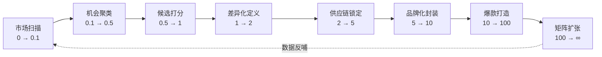

哈佛团队的选品系统不是一个**单点决策**，而是一个**七环闭环**：每一环都是 LLM Agent 可独立运行的子任务，整体由一个 Orchestrator Agent 调度。

> 与传统人工选品的根本差别：**人工选品是"瀑布式"（先选完再做），AI 选品是"螺旋式"（每个 cluster 同时并行扫描，结果互相验证、互相否决）。**

### 1.1 七大 cluster 的核心哲学一句话

| Cluster | 一句话哲学 | 数据信号源 | 适用阶段 |
|---|---|---|---|
| **C1 数据驱动** | 用海量数据特征过滤大市场，找蓝海利基 | 工具 API（卖家精灵 / Helium10 / JS） | 0 → 0.1 |
| **C2 榜单复制** | 站在已验证的肩膀上，最低成本切入 | 亚马逊 BSR / NR / M&S / MWF / GI | 0 → 0.5 |
| **C3 痛点差异化** | 从 1-3 星差评中找改良缺口 | Review / QA / Voice of Customer | 0.5 → 2 |
| **C4 品牌化打爆** | 以护城河和复购为目标重定义产品 | DTC 案例库 + 复购数据 + 社区 | 2 → 100 |
| **C5 供应链反推** | 从工厂/产业带优势倒推可做的产品 | 1688 / 展会 / 自有供应链 | 任何阶段 |
| **C6 趋势/节奏** | 抓节日/事件/社媒/独立站早期信号 | Google Trends / TikTok / 独立站 | 0.1 → 5 |
| **C7 AI 原生** | 选「能被 AI 推荐」的产品 | Rufus / COSMO / 多模态 embedding | 2026 全阶段 |

### 1.2 七大 cluster 的关系矩阵（互补 vs 互斥）

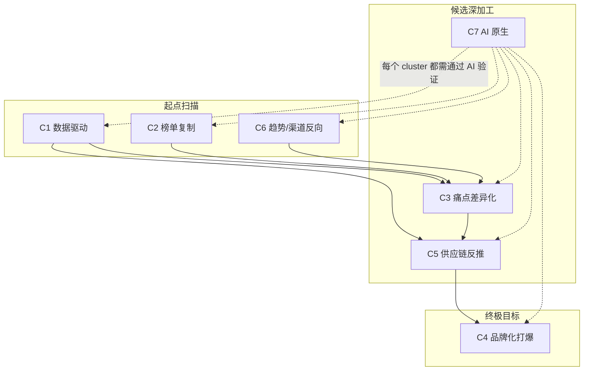

**关键洞察**：C7（AI 原生）不是与其他 cluster 并列的策略，而是**贯穿全 cluster 的「质量过滤层」**——任何 cluster 产出的候选品最终都要通过 C7 的"是否能被 Rufus 推荐 / use-case 是否明确 / Q&A 富度是否够"这套 AI 时代过滤。

---

## 2. 七大战略 cluster 全景（一级聚类）

```
🎯 Amazon 选品策略全景
│
├─ 🟦 C1 数据驱动型选品 (Data-Driven Discovery)
│   ├─ C1.1 工具大数据筛选法（卖家精灵 22 维 / Sorftime 32 思路 / JS Opportunity Finder / Helium10 Black Box）
│   ├─ C1.2 ABA 关键词反查法（搜索量 / 点击共享 / 转化共享 / 季度增量公式）
│   ├─ C1.3 维度评分卡（7 段式 100 分 / 21 项 88 分 / JS Niche Score / 16 维度评估）
│   └─ C1.4 市场 10 维度调研（容量+垄断+卖家分布+评价+价格区间）
│
├─ 🟩 C2 榜单 + 店铺复制 (Best-Seller & Shop Mimicry)
│   ├─ C2.1 五大榜单挖掘（BSR / New Releases / Movers & Shakers / Most Wished For / Gift Ideas）
│   ├─ C2.2 精品店铺复制法（5-10 SKU / 月销 500+ / 净利 15%）
│   ├─ C2.3 品牌上新监控（Anker / Patozon / mpow 头部品牌新品跟踪）
│   └─ C2.4 帕拓逊式 ASIN 全维度拆解
│
├─ 🟥 C3 痛点驱动差异化 (Pain-Point Differentiation)
│   ├─ C3.1 1-3 星差评挖掘法（100×5星 + 100×1星 交叉痛点）
│   ├─ C3.2 Review Mining LLM 聚类（VOC.AI / SmartScout AI Sentiment）
│   ├─ C3.3 MVP 7 步迭代（机会评估→市场→原型→评审→MVP→验证→改进）
│   ├─ C3.4 八维差异化矩阵（数量+搭配+材质+外观+功能+受众+场景+元素）
│   └─ C3.5 4.3 分分水岭分流（>4.3 走属性差异化 / <4.3 走痛点改造）
│
├─ 🟧 C4 品牌化爆款打造 (Brand-First Hit Building)
│   ├─ C4.1 Sidekick 矩阵设计（Anker 充电生态范本）
│   ├─ C4.2 复购属性筛选（消耗品 / 订阅 / 连续性 / LTV:CAC ≥2-3）
│   ├─ C4.3 三位一体（Amazon + 独立站 + 社媒）
│   ├─ C4.4 Hero SKU + Lean Launch 路径
│   ├─ C4.5 新品成长飞轮（开发 4 环节 + 运营 3 环节）
│   └─ C4.6 新品冷启动铁三角（备货 / 详情页 / 运营推广）
│
├─ 🟪 C5 供应链反推 (Supply-Chain Reverse)
│   ├─ C5.1 1688 产业带反查（找产业带 → 反查亚马逊市场）
│   ├─ C5.2 大型展会 + 工厂对话（广交会 / CES / 大牌供应商）
│   ├─ C5.3 私模开模差异化（独占颜色 / 形状 / 配件）
│   ├─ C5.4 6 步供应商评估（确认样品 / 普货vs带电测试 / 测量包装）
│   ├─ C5.5 首批采购量公式 = (采购+入库) × (备货天数×日均销量)
│   └─ C5.6 精铺 vs 精品双模式分流（资金 < 50k → 精铺；> 200k → 精品）
│
├─ 🟨 C6 趋势 / 节奏 / 渠道反向 (Trend Timing & Off-platform Discovery)
│   ├─ C6.1 季节性产品法（Softime / 卖家精灵 / Google Trends 三工具交叉）
│   ├─ C6.2 节日选品（圣诞 / 万圣 / 情人节 / 母亲节，备货倒推）
│   ├─ C6.3 热点选品（奥运 / 政治 / 世界杯 / 疫情 / 电影热度）
│   ├─ C6.4 社媒选品（TikTok / Instagram / Pinterest / BigSpy / FindNiche）
│   ├─ C6.5 独立站 + 众筹（Shopify 爆款 / Kickstarter / Indiegogo）
│   ├─ C6.6 线下转线上趋势（价格差 >50% / 功能补充 / 外观补充）
│   └─ C6.7 35 个垂直电商网站资源池
│
└─ 🟫 C7 AI / COSMO 原生选品 (AI-Native Selection · 2026 新增)
    ├─ C7.1 COSMO Readiness 判别（use-case 明确度 / claim-review 一致性 / Q&A 富度）
    ├─ C7.2 Rufus-Friendly Listing 反推选品（功能/技术/参数富度）
    ├─ C7.3 多模态 review embedding 选品（文本 + 主图 + 视频 + QA）
    ├─ C7.4 LLM Agent 自动 pipeline（DeepSeek / Claude / GPT 7 步实现）
    ├─ C7.5 跨类目痛点迁移（哈佛护城河方向）
    └─ C7.6 因果推断 spec 优化（"改一项规格能拉升多少 CR"）
```

---

## 3. Cluster 1：数据驱动型选品 (Data-Driven Discovery)

### 3.0 Cluster 哲学

**核心理念**：在亚马逊「大海捞针」的体量下，第一步永远是「数据漏斗」。用工具 API 把 4.5 亿 ASIN 缩到 100 个候选，再做人 / Agent 判断。

**适用阶段**：从 0 → 0.1（第一次进入一个新市场）

**输入数据信号**：工具 API（卖家精灵 / Helium10 Black Box / JS Opportunity Finder / Sorftime）+ 亚马逊 ABA 后台 + Keepa 历史曲线

**Cluster 级 AI Agent 建议**：构建一个 **"Discovery Agent"**，定时（每周）扫描 N 个一级类目下的子类，按下述 4 个 L2 策略并行打分，输出 **"Top 50 候选池 + 每个的 8 维数据画像"**，交给后续 cluster 处理。

---

### 3.1 C1.1 工具大数据筛选法

#### 触发条件
- 团队刚刚进入一个新类目，没有任何先验候选品
- 资金 / 时间允许跑大量数据筛选（典型场景：每周自动扫描 5-10 个一级类目）
- 目标：从 4.5 亿 ASIN 缩到 100 个候选 ASIN 池

#### 数据源（精确到字段）

| 平台 | 接入方式 | 关键字段 |
|---|---|---|
| **卖家精灵 Sellersprite** | Web / API | 市场容量、品牌数量、新品占比（3-6 月）、垄断系数、平均评分、平均月销、退货率、广告占比、A+ 占比、价格区间分布、点击集中度 |
| **Helium 10 Black Box** | API 订阅 ($39-279/月) | BSR、Listing Age、月营收、平均评分、销售趋势、Review Count、Shipping Size Tier、20+ 高级字段 |
| **Jungle Scout Product Database & Opportunity Finder** | Web / API | Niche Score (1-10)、Avg Monthly Units、Avg Monthly Revenue、Avg Price、Avg Reviews、Avg Rating、Listing Quality Score (LQS) |
| **Sorftime** | 端软件 / 插件 | 市场看板（TOP100 / TOP400）、产品看板、关键词看板 32 思路 |
| **Keepa** | API | 历史 BSR 曲线、价格曲线、评论数变化、断货时间、Deal 历史 |
| **亚马逊前台** | 爬虫 / SP-API | 类目树、BSR 五大榜单、首页搜索结果、关联流量 |

#### 决策链路

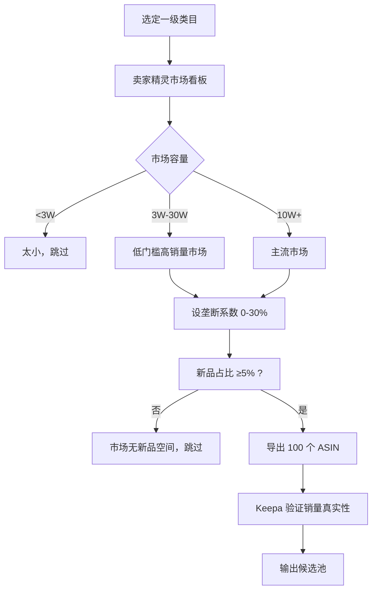

#### 关键参数表

| 参数 | 红线 (Reject) | 健康区 | 极优区 | 置信度 | 来源 |
|---|---|---|---|---|---|
| 市场容量（月销售额） | < $30K | $30K-$300K（中小卖适合） | $300K-$1M（大市场切口） | 🟢 | 内部材料 #1, #4 / SellerSprite |
| 月销量门槛（单 ASIN） | < 300 单/月 | 300-1,000 单/月 | 500-1,500 单/月 | 🟢 | Pangol Info 2026 / Helium10 |
| BSR 主类目 | > 100,000 | < 50,000 | < 10,000 | 🟢 | 内部 #1 / JS 教程 |
| 垄断系数（TOP 3 销量占比） | > 60% | 30-50% | < 30% | 🟢 | SellerSprite / Sorftime |
| 品牌集中度 | 单品牌 > 50% | < 40% | < 30% | 🟢 | 内部材料 #4 |
| 新品占比（3-6 月内上架） | < 3% | > 5% | > 10% | 🟢 | Sorftime / 内部 #4 |
| 平均评分 | < 3.6 或 > 4.7 | 3.8-4.5（有改进空间） | 3.8-4.3（最大机会） | 🟢 | 内部 #3 / SOTA |
| 头部 listing 平均评论数 | > 5,000 | 100-1,000 | < 500 | 🟢 | Pangol Info |
| 价格带（甜区） | < $15 或 > $100 | $20-$70 | $25-$70 | 🟢 | 内部 #6, #15 / SOTA |
| LQS (JS Listing Quality Score) | – | – | < 5（有优化空间） | 🟡 | JS 官方 |
| Niche Score (JS) | < 6 | ≥ 7 | ≥ 8 | 🟢 | JS 官方 |

#### AI 化建议

1. **特征工程**：把所有工具字段合并成一个 30 维特征向量，每个 ASIN / niche 一行。
2. **打分模型**：用 XGBoost / LightGBM 学一个「成功新品概率」分类器，用历史已知的成功 / 失败 ASIN 作为训练样本。
3. **Agent 自动化**：写一个 `discovery_agent.py`，每周自动调用卖家精灵 + Helium10 + JS API，输出 Top 50 候选池到 Notion / 飞书。
4. **去重 + 多工具一致性**：同一个 niche 被 ≥2 个工具列入 Top 推荐 → 优先级 +1。

#### 典型案例

- **卖家精灵 22 思路 #6（稳定出单潜力）**：当前 BSR 3K-2W；30 天前 BSR 3K-2W；变化率 0-20%；总评论 < 50。
- **Sorftime 32 思路 #3（冷门潜力爆品）**：BSR 最大 5000；评论 0-50；上架 3 月内；BSR 上升；首次上架 1 年内；市场容量 8K-100K。
- **JS Cold Brew Machine 案例**：机会分数 3（不推荐）、平均月销 855、平均价 $72.98、平均评论 487 → 评论 > 100 = 竞争已重，应跳过。

#### 风险与反例

- ⚠️ **工具数据有 10-30% 误差**：JS 销量预估精准度 80-90%，仍需 Keepa 二次验证。
- ⚠️ **垄断 > 50% 不一定不能做**：要看 listing 表现 / 新品表现 / 利润，**单点垄断系数不能一票否决**。
- ⚠️ **小类排名 < 50 而大类 > 30,000 是陷阱**：说明类目太小，月销实际可能 < 30 单。

---

### 3.2 C1.2 ABA 关键词反查法

#### 触发条件
- 已有亚马逊品牌注册（可使用 ABA 后台）
- 希望从「用户真实搜索行为」反推选品方向
- 适用于已经有一个类目方向但不确定具体打哪个细分

#### 数据源

| 平台 | 接入方式 | 关键字段 |
|---|---|---|
| **亚马逊 ABA (Brand Analytics)** | 后台（需 Brand Registry）/ 周报 CSV | 部门、搜索词、搜索频率排名、#1/#2/#3 已点击 ASIN、**点击共享 (Click Share)**、**转化共享 (Conversion Share)** |
| **卖家精灵 ABA 反查** | API | 关键词搜索量、月环比、季度环比、相关 ASIN、广告占比 |
| **Helium 10 Cerebro / Magnet** | API | 关键词 → ASIN 反查、ASIN → 关键词反查 |

#### 决策链路：季度增量产品公式

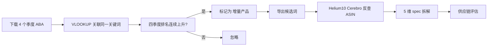

#### 关键参数表

| 参数 | 红线 | 健康区 | 极优区 | 置信度 | 来源 |
|---|---|---|---|---|---|
| 主关键词月搜索量 | < 3,000 | 6,000-30,000 | 8,000-15,000 | 🟢 | 内部 #15 / SOTA |
| 主关键词搜索排名（ABA） | > 100,000 | < 50,000 | < 10,000 | 🟢 | 内部 #15 |
| Top 1 点击共享 | > 30%（被垄断） | 5-15% | 5-10% | 🟢 | 内部 #15 |
| Top 3 累计点击共享 | > 50% | 20-40% | 15-30% | 🟢 | 内部 #15 |
| 转化共享 vs 点击共享 | 转化共享 < 点击共享 一半（漏斗深问题） | 接近 | 转化共享 ≥ 点击共享 | 🟡 | 内部 #15 |
| 季度增量公式 | 4 季排名不连续上升 | 3 季连降 | 4 季排名连降 | 🟢 | 内部 #16, #17 |
| **特征词搜索热度** | – | – | `(1/搜索频率排名)*100,000` | 🟢 | 飞轮 PDF |

#### AI 化建议

1. **Embedding 化**：把 ABA 每周 100W 行搜索词做 sentence embedding，自动聚类成「场景簇」「材质簇」「人群簇」。
2. **变化检测**：每周比较前后两周聚类分布，发现新出现的"语义簇"（如 "TikTok-viral" 新词），立刻报警。
3. **Agent 实现**：`aba_quarterly_agent.py` 输入 4 季度 CSV、输出 Excel 包含「关键词、四季排名、是否增量、相关 ASIN、推断 spec」。

#### 典型案例

- **nerf guns**：24 → 7 → 3 → 2（4 季排名连降）= 增量产品
- **baby yoda**：10,000 → 383 → 308 → 15 = IP 类增量产品（注意侵权风险）
- **office chair**：搜索排名 19；Top 1 点击共享 9.57%；说明分散性强、单点击共享 < 10%，是 **未被垄断的大市场**

#### 风险与反例

- ⚠️ **ABA 数据滞后 1-2 周**：周报数据是 T-7 to T-14；如果是季节性快变品类，可能错过窗口
- ⚠️ **点击共享不等于成交份额**：高点击共享但低转化共享 = "listing 优化空间大，但产品本身可能有问题"
- ⚠️ **季度增量公式可能抓到一过性热点**：建议结合 Google Trends 同步验证是否长期趋势

---

### 3.3 C1.3 维度评分卡（7 段式 / 21 项 / 16 维度）

#### 触发条件
- 已经从 C1.1 / C1.2 拿到候选池 50-100 个
- 需要做"GO / NO-GO"决策
- 要求**可解释**的打分（区别于 ML 黑盒）

#### 数据源

依赖前两个 L2 的所有字段 + 团队自己填的「资金/技术/竞争对手主观分」。

#### 决策链路：7 段式打分（基线公式 · 满分 ~100）

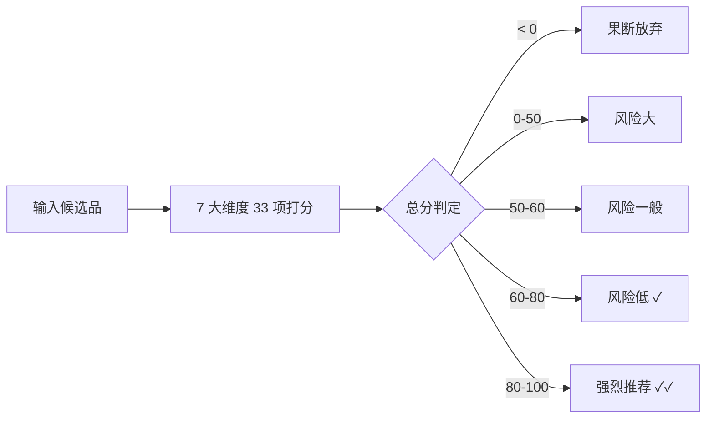

#### 关键参数表（完整 7 段式打分细则）

> 详细 33 项请见附录 A.1。此处摘录强惩罚项：

| 项目 | 阈值 | 分值 | 说明 |
|---|---|---|---|
| **竞争 > 需求** | – | **−50** | 致命否决 |
| **处于衰退期** | – | **−50** | 致命否决 |
| 近 3 月价格剧烈下降 | – | −30 | 红海打价格战信号 |
| 销量持续 < 10 单/天 | – | −20 | 体量太小 |
| 评论量 > 2,000 | – | −20 | 老竞品太多 |
| 选品 BSR > 30,000 | – | −10 | 流量不够 |
| 通用搜索词月搜 > 5万 | – | +10 | 大市场 |
| 评论量 < 100 | – | +10 | 切口窗口 |
| 净利率 > 50% | – | +2 | 高利润 |
| 净利率 < 20% | – | −10 | 利润不足 |

#### 21 项 88 分制（补充打分）

| 项目 | 阈值 | 分值 |
|---|---|---|
| 售价 $15-$60 | – | +5 |
| 关键词 TOP3 月搜 > 100K | – | +5 |
| 4-20 名平均评价 < 100 | – | +5 |
| 重量 < 1 磅 | – | +4 |
| 体积 < 8×8×8 inch | – | +4 |
| 包装可脱颖而出 | – | +5 |
| 航运价占售价 ≤ 20% | – | +5 |
| 初次备货 < 500 PCS | – | +4 |
| 总分判定 | 0-40 不做 / 40-50 不建议 / 50-65 不错 / >65 非常不错 | – |

#### AI 化建议

- **打分自动化**：把 7 段式 + 21 项的全部规则写成 YAML 规则文件，由一个 Rule Engine（如 Drools / Python 简化版）执行
- **可解释报告**：每个候选品输出 "得分 81，扣分项：差评 < 100（+10）、净利率 35%（+2）、竞争 = 需求（+5）..." 的完整审计trail
- **A/B 校准**：每月用真实新品成败结果反向校准每个参数的权重

#### 典型案例

- **7 段式高分案例**：Trellises 子类（评分 4.4 / 月销 5,133 / FBA 92% / 价格符合 / 新品占比高）→ 78 分 → 推荐
- **21 项低分案例**：售价 $8 的薄利品 → 售价 -5、航运占比 > 20% -5 → 38 分 → 不做

#### 风险与反例

- ⚠️ **打分卡是过滤器，不是预测器**：80 分不等于一定成功，60 分以下也不等于一定失败
- ⚠️ **季度更新参数**：FBA 费率、退货阈值、Rufus 影响都在 2026 年快速变化，不能锁定 v1.0 不动

---

### 3.4 C1.4 市场 10 维度调研（Bath Rugs 案例式）

#### 触发条件
- 单个候选品类需要做"是否值得入场"的深度尽调
- 在 C1.3 打分 > 60 之后启动

#### 数据源

卖家精灵市场看板（5 大板块）+ Helium10 Market Tracker + Keepa 类目历史 + Google Trends + 同站点 / 多站点对比

#### 决策链路：10 维度调研

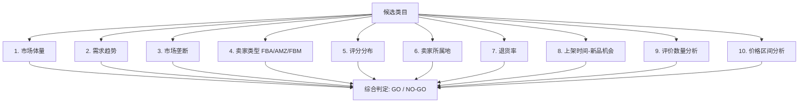

#### 关键参数表

| 维度 | 红线 | 健康区 | 极优区 | 置信度 | 来源 |
|---|---|---|---|---|---|
| 1. 市场体量 | < $30K（偏小） | $30K-$1M | $100K-$500K | 🟢 | 内部 #4 |
| 2. 趋势（Google Trends） | < 30 且下降 | > 30 上升或持平 | 持续上升 12 个月 | 🟢 | 内部 #4, #12 |
| 3. 市场垄断（TOP 10 销售额占比） | > 50% | < 30% | < 20% | 🟢 | 内部 #4 |
| 3. 品牌集中度 | > 70% | < 40% | < 30% | 🟢 | 内部 #4 (Bath Rugs 70.4% 偏高) |
| 4. 卖家类型 | AMZ 自营 > 30% | FBA > 50%, AMZ < 10% | FBA > 70%（高效市场） | 🟢 | 内部 #4 |
| 5. 平均评分 | > 4.5（无改进空间） | 3.8-4.3 | 3.8-4.0 | 🟢 | 内部 #3, #4 |
| 6. 卖家所属地 | 全美本土（对中国不友好） | 中国 + 美国 混合 | 中国 > 40% | 🟡 | 内部 #4 |
| 7. 退货率 | ≥ 15% 高风险 | 5-15% 中 | < 5% 高接受 | 🟢 | 内部 #9 (蓝海 docx) / Eightx |
| 8. 新品占比（6 月内） | < 3% 无空间 | > 5% | > 10% 朝阳市场 | 🟢 | 内部 #4, #11 |
| 9. 评论数门槛 | 全部 > 1,000（壁垒高） | 200-1,000 | 50-500 | 🟢 | 内部 #4 |
| 10. 价格区间销量峰值 | – | $15-$30 | $20-$30（甜区） | 🟢 | 内部 #7, #23 |

#### AI 化建议

- **10 维度 Agent 报告生成器**：输入候选类目 URL，自动并行调用 10 个子工具，5 分钟内输出 PDF 调研报告
- **跨站点对比**：US/UK/DE/JP 同步跑同一类目，输出"全球矩阵机会图"
- **Bath Rugs 案例反向训练**：用过去 100 个失败 / 成功类目作训练集，让模型学到「品牌集中度 70% + 评分 > 4.3 + 卖家所属地全美」组合 → 必败信号

#### 典型案例

- **Bath Rugs 案例**：100 样本 / 销售额 $158K / 平均销量 8,800 / 平均价 $19.03 / 品牌集中度 70.4% → 判定 **谨慎入场**
- **Standing Desk 案例**：Top100 中 93% 是 2016 年后上架 / 47% 2018 年新上架 / 89% 无跟卖 / 4.5 星 58 个 → 朝阳市场 **建议进入**

#### 风险与反例

- ⚠️ **退货率数据滞后**：亚马逊后台只给已售产品的退货率，新品要参考类目平均
- ⚠️ **品牌集中度的「软指标」**：有时一个新品牌占 30% 不代表垄断，要看品牌成立时间

---

## 4. Cluster 2：榜单 + 店铺复制 (Best-Seller & Shop Mimicry)

### 4.0 Cluster 哲学

**核心理念**：选品最大的不确定性是「市场是否真的存在」，而五大榜单 + 精品店铺已经替我们验证过。直接复制 + 微改 = 最低风险的入场。

**适用阶段**：0 → 0.5（首次进入但已有方向）

**Cluster 级 AI Agent 建议**：构建 **"Mimicry Agent"** —— 每周扫描 BSR / NR / M&S 榜单变化、追踪头部品牌新上架，并和精品店铺数据库对比，自动发现"刚刚被验证有效"的产品方向。

---

### 4.1 C2.1 五大榜单挖掘法

#### 触发条件
- 起步阶段，缺少先验经验
- 希望快速通过"亚马逊已经验证过的市场"找方向
- 资金、时间有限，无法做大规模数据扫描

#### 数据源

| 榜单 | URL 路径 | 用途 |
|---|---|---|
| **Best Sellers (BSR)** | amazon.com/Best-Sellers/zgbs | 实时销量榜，每小时更新 |
| **New Releases (NR)** | amazon.com/gp/new-releases | 新品 90 天榜（最重要：找朝阳 / 新切口） |
| **Movers & Shakers (M&S)** | amazon.com/gp/movers-and-shakers | 24 小时排名上升最快 = 突发热点 |
| **Most Wished For (MWF)** | amazon.com/gp/most-wished-for | 心愿单数最多 = 未满足需求 |
| **Gift Ideas (GI)** | amazon.com/gp/most-gifted | 礼物属性产品 |

补充：**Outlet（奥特莱斯）/ Today's Deals**——大量退货回流的特殊高销品，常被忽略。

#### 决策链路

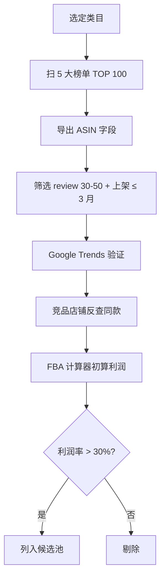

#### 关键参数表

| 参数 | 红线 | 健康区 | 极优区 | 置信度 | 来源 |
|---|---|---|---|---|---|
| Review 数 | > 几千（大热） | 30-200 | 30-50（最甜） | 🟢 | 内部 #14, #17 |
| 上架时间 | > 2 年（老品红海） | 3-12 个月 | 3-6 个月（新品扶持期） | 🟢 | 内部 #17 |
| 首页日销 | < 30 单（大冷） | 100-500 | 200-500 | 🟢 | 内部 #17 |
| BSR 大类排名 | > 30,000 | < 5,000 | < 2,000 | 🟢 | 内部 #15 |
| BSR 小类排名 | > 100 | < 50 | < 20 | 🟢 | 内部 #11 |
| Movers & Shakers 名次升幅 | < 50% | 100-500% | > 500%（小心一过性热点） | 🟡 | 内部 #14 |

#### AI 化建议

- **每日 Agent 扫描**：`bsr_agent.py` 抓 50+ 子类的 TOP 100 + NR TOP 50 + M&S TOP 30，存入数据库，每周对比发现"新进入榜单"的 ASIN
- **Outlet 监测**：很多团队忽略 Today's Deals 和 Outlet —— 这两个榜单天然有"高销已被验证"+"价格弹性大"的双重信号
- **跨榜单交叉**：同时出现在 NR + M&S（新品 + 上升快）= 朝阳新品强信号

#### 典型案例

- **东京奥运周边（2021/7/23-8/8）**：在 M&S 提前 1-2 周出现 → 立刻备货 → 短期爆发
- **指尖陀螺反例**：突然占领 BSR → 1 个月内崩盘 → 不要为"突然热"备货

#### 风险与反例

- ⚠️ **快进快出热点**（指尖陀螺、Fidget Cube、Pop It）：从 M&S 起到 BSR 崩盘通常 < 3 个月
- ⚠️ **被亚马逊自营垄断**：很多 BSR Top 10 是 Amazon Basics → 跟卖必死
- ⚠️ **季节性陷阱**：圣诞前 11 月的 BSR 不代表平时销量，要看 Keepa 全年曲线

---

### 4.2 C2.2 精品店铺复制法

#### 触发条件
- 零经验新手或新进入一个类目
- 没有自有供应链优势
- 想用最低的认知成本复制已被验证的成功

#### 数据源

| 平台 | 字段 |
|---|---|
| 卖家精灵「选店铺」 | 店铺 SKU 数、平均月销、店铺总月销、上新频率、产品平均评分 |
| 亚马逊店铺前台 | 店铺名、Storefront、产品列表 |
| Keepa | 单 SKU 历史 BSR / 价格 / 评论曲线 |

#### 决策链路：5 步精品店复制法

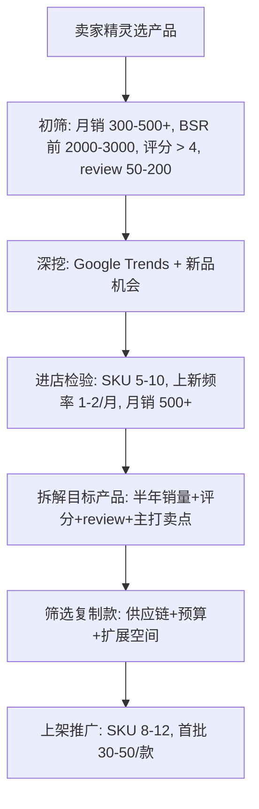

#### 关键参数表

| 参数 | 红线 | 健康区 | 极优区 | 置信度 | 来源 |
|---|---|---|---|---|---|
| 目标店铺 SKU 数 | > 50（铺货型，不要复制） | 5-10（精品） | 5-7（极精） | 🟢 | 内部 #16 |
| 头部产品 BSR | > 500 | 100-300 | < 200 | 🟢 | 内部 #16 |
| 头部产品月销 | < 300 | 500-1,000 | > 600 | 🟢 | 内部 #16 |
| 店铺净利率 | < 10% | > 15% | > 20% | 🟡 | 内部 #16 |
| 上架时长 | > 2 年（成熟竞争激烈） | 6-12 个月 | 6-9 个月 | 🟢 | 内部 #16 |
| 上新频率 | < 1 款/季度 | 1-2 款/月 | 1-2 款/月（活跃） | 🟢 | 内部 #16 |
| 自家首批备货 | > 200 件/款 | 30-50 件/款 | 30 件/款 | 🟢 | 内部 #16 |
| 自家 SKU 矩阵 | 1 款（孤品） | 8-12 款 | 10 款 | 🟢 | 内部 #16 |

#### AI 化建议

- **店铺指纹挖掘**：每个目标店铺的 SKU 用 LLM 自动归类（材质/颜色/尺寸/价格带），生成"店铺策略画像"
- **复制策略 Agent**：输入「珠宝收纳盒」种子词 → Agent 自动找出 Top 5 精品店 → 对比 SKU 矩阵 → 输出"8-12 款 SKU 复制方案"
- **反向规避**：识别铺货型大卖（SKU > 50）+ 短期火爆店铺 → 自动排除

#### 典型案例

- **8 格分层珠宝收纳盒**：月销 650 / BSR 1,800 / 售价 $34.99 / FOB+FBA 成本 $12-15 / 净利 30%+ / 复制方案：8 格 + 12 格 + 多层旋转 3 款
- **Homykic 马桶置物架**：上架 6 个月 / BSR 第 6 / 市场垄断 < 30% / 整体上升趋势 → 复制者直接进入

#### 风险与反例

- ⚠️ **店铺火爆但不稳定**：3 个月销量翻 10 倍的店有可能是黑科技，不要复制
- ⚠️ **铺货型大卖的"精品 SKU"**：要剔除铺货型大卖的 5 SKU 子集——他们的成功来自总流量，不是单品
- ⚠️ **复制 ≠ 抄袭 listing**：必须做主图 / 五点 / A+ 完全重写，否则会被申诉

---

### 4.3 C2.3 品牌上新监控（追踪头部品牌）

#### 触发条件
- 已有目标类目
- 类目中有 1-3 个公认大卖（Anker、SHEIN、Patozon、mpow 等）
- 希望"跟着大佬吃肉"

#### 数据源

| 平台 | 字段 |
|---|---|
| 卖家精灵「品牌上新监控」 | 品牌名 + 时间筛选 → 新 SKU 列表 + 销量 |
| Helium 10 Cerebro / Brand Search | 品牌 ASIN 矩阵 |
| 品牌官方 Storefront | A+ 设计 / 视频内容更新 |
| 品牌社媒 / 独立站 | 新品营销话术 |

#### 决策链路

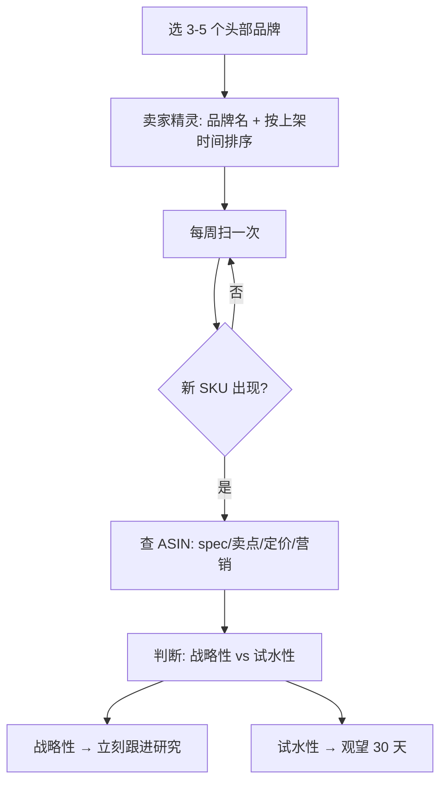

#### 关键参数表

| 参数 | 红线 | 健康区 | 极优区 | 置信度 | 来源 |
|---|---|---|---|---|---|
| 监控频率 | < 月度 | 周度 | 实时（webhook） | 🟢 | – |
| 新品出现到跟进时间 | > 60 天 | 14-30 天 | < 14 天 | 🟢 | – |
| 选 N 个品牌 | < 3 | 3-5 | 5-10 | 🟡 | – |
| 跟进判定：新品 BSR 进入 Top X | > Top 5,000 | Top 1,000 | Top 500（确实在打爆） | 🟢 | – |

#### AI 化建议

- **新品检测 Agent**：每周扫品牌 ASIN，diff 出新增 ASIN，发飞书 / Slack
- **新品快速尽调**：新 ASIN 出现 → 自动调用 C1.4 10 维度调研 Agent → 5 分钟出报告

#### 典型案例

- **Anker** 新出充电桩 → 暴露了「便携 + 大功率 + 多设备」新方向 → 跟卖者立即跟进
- **Patozon mpow** 蓝牙音箱 → 帕拓逊式拆解：ASIN B01NAJGGA2 / 评分 4.3 / Top 10 review 词云分析

#### 风险与反例

- ⚠️ **大牌的"清库存式"上新**：有些大牌新品其实是清旧库存，跟进会被库存价格打挂
- ⚠️ **大牌的私模产品**：模具成本几十万，小卖跟不起

---

### 4.4 C2.4 帕拓逊式 ASIN 全维度拆解

#### 触发条件
- 已锁定具体竞品 ASIN（来自 C2.1-2.3 或 C1）
- 准备做"复制 + 微改"

#### 数据源

亚马逊前台 ASIN 详情页 + Helium 10 X-Ray + 卖家精灵 ASIN 反查 + Keepa

#### 决策链路：5 步拆解

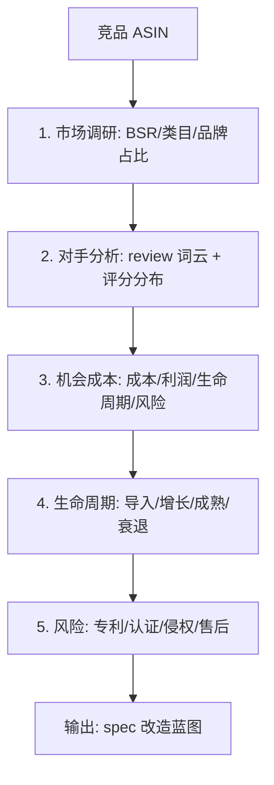

#### 关键参数表

| 参数 | 红线 | 健康区 | 极优区 | 置信度 | 来源 |
|---|---|---|---|---|---|
| Top 50 上架年份分布 | 全部 > 2018 | 60% 在最近 2 年 | 51% 在最近 1 年（朝阳） | 🟢 | 内部 #5, #11 |
| 单 ASIN 评分 | < 3.9 | 4.0-4.5 | 4.3-4.5 | 🟢 | 内部 #4, #8 |
| review 词云中差评频次最高词 | – | 至少 3 个改造点 | 5+ 改造点 | 🟢 | 内部 #4 |
| **日销 RV 推算公式** | – | – | `日销 = 周RV / 7 × 50` | 🟢 | 内部 #12 |
| 类目首次上架时间 | > 5 年（成熟期） | 1-3 年（增长期） | < 2 年（导入期） | 🟢 | 内部 #12 |

#### AI 化建议

- **ASIN 一键拆解 Agent**：输入 ASIN URL → 5 分钟输出 PDF（含市场+对手+风险+spec 蓝图）
- **review 词云自动化**：用 LLM 抽出 review 中最高频的"卖点词 + 痛点词"，自动生成"保留卖点 / 改造痛点"清单

#### 典型案例

- **帕拓逊 mpow 蓝牙音箱拆解**：review 关键词词云 → 蓝牙 9.18% / 相机 6.12% / 动作 4.08% / 焊接 3.06% → 确定主打蓝牙 + 相机配对场景

#### 风险与反例

- ⚠️ **review 翻译不准**：英文 review 用 LLM 翻译会丢细节，建议用 GPT-4 / Claude 等 SOTA 模型
- ⚠️ **专利 / 商标侵权**：拆解前必须做 FTO（Freedom to Operate）专利检索

---

## 5. Cluster 3：痛点驱动差异化 (Pain-Point Differentiation)

### 5.0 Cluster 哲学

**核心理念**：在亚马逊的红海里，颠覆性创新风险太高；改良现有产品（review mining + spec 升级）才是最稳健路径。差评不仅是问题，**差评是被付费验证过的需求清单**。

**适用阶段**：0.5 → 2（已有候选池，需要做差异化定义）

**Cluster 级 AI Agent 建议**：构建 **"Pain Miner Agent"** —— 自动抓 Top N ASIN 全量 review → LLM 语义聚类 → 痛点频次×严重度排序 → 输出 spec 改造蓝图。这是哈佛团队最大的 AI 价值释放点之一。

---

### 5.1 C3.1 1-3 星差评挖掘法

#### 触发条件
- 已有 5-10 个候选竞品 ASIN（review 数 ≥ 100 才能 mining）
- 团队有能力做产品微改 / 工厂沟通

#### 数据源

| 数据 | 平台 | 字段 |
|---|---|---|
| 全量 review | 亚马逊前台爬虫 / Reviews Scraper API / Apify | 评分 / 评论文本 / Verified Purchase / 日期 / Helpful 数 |
| Q&A | 亚马逊前台 | 问题文本 / 回答数 / 高赞回答 |
| Review Insights | 亚马逊后台（部分类目） | 自动分桶（durability/value/design 等） |

#### 决策链路：差评双轨法

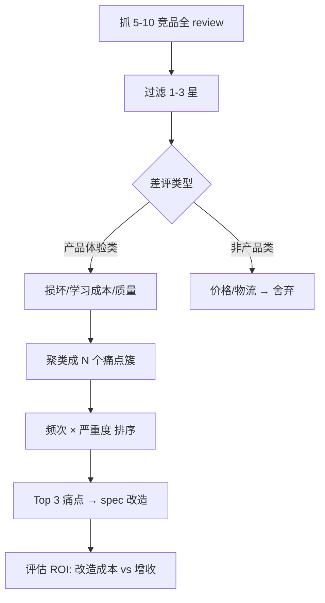

#### 关键参数表

| 参数 | 红线 | 健康区 | 极优区 | 置信度 | 来源 |
|---|---|---|---|---|---|
| 单 ASIN 最少 review 数（值得 mining） | < 100 | 200-500 | > 500 | 🟢 | 内部 #5 |
| 抓取 N 个 ASIN | < 3 | 5-10 | 10-20 | 🟢 | 内部 #4, #5 |
| 1-3 星 review 比例（值得改造） | < 5% | 10-30% | > 30%（有大改造空间） | 🟢 | 内部 #5 |
| 差评聚类数 | 1（笼统） | 4-8 簇 | 5-7 簇（最佳粒度） | 🟢 | 内部 #5 LED 镜案例 |
| 单簇频次占比 | < 5% | 10-30% | > 30%（值得 spec 改） | 🟢 | 内部 #5 |
| **5 星 / 1 星交叉法样本量** | – | 各 100 条 | 各 200 条 | 🟢 | 内部 #7 |

#### AI 化建议

- **LLM 聚类**：把 review 文本做 embedding（OpenAI text-embedding-3-large / BGE-M3），KMeans 聚成 5-7 簇，每簇用 GPT-4 总结一句话标签
- **严重度评分**：除了频次，让 LLM 对每条差评打"严重度 1-5"分（影响购买决策的烈度），频次×严重度才是排序依据
- **ROI 模型**：给每个 spec 改造（如换电池、加传感器）估算工厂报价 + 预期 CR 提升 → 自动算 ROI

#### 典型案例

- **LED 旅行化妆镜**：86 条差评 / 72 条有效 / 聚类成 4 类（质量 32% / 其他 38% / 镜面 19% / 灯珠 11%）→ 改造方向：用优质灯珠、耐摔塑料、双面镜 + 适中放大倍数
- **迷你封口机**：差评 1 电路烧坏 → 升级元器件；差评 2 移动速度难控 → 加速度传感器 + 蜂鸣器

#### 风险与反例

- ⚠️ **非产品类差评干扰**：物流损坏、价格不满意 → 优化这些 ROI 接近 0
- ⚠️ **改造成本黑洞**：加传感器看着小改，实际开模 + BOM 增加 30% 成本 → 必须先估 ROI
- ⚠️ **review 翻译噪音**：俄语 / 德语 review 用机器翻译质量低，建议用 GPT-4 / Claude

---

### 5.2 C3.2 Review Mining LLM 聚类（哈佛 AI 强项）

#### 触发条件
- 同 C3.1，但已有 LLM / embedding 基础设施
- 希望批量化处理 100+ 个 ASIN 的 review 池（10,000+ 条）

#### 数据源

抓 review 用：Apify / Bright Data / Helium 10 Listing Optimizer / VOC.AI / SmartScout Sentiment

#### 决策链路：标准 Review Mining Pipeline

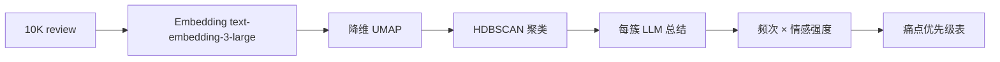

#### 关键参数表（哈佛 SOTA 工程实现建议）

| 参数 | 推荐值 | 来源 |
|---|---|---|
| Embedding 模型 | OpenAI text-embedding-3-large 或 BGE-M3 | SOTA |
| 降维方法 | UMAP (n_neighbors=15, min_dist=0.1) | SOTA |
| 聚类方法 | HDBSCAN (min_cluster_size=20) | SOTA |
| 簇标签生成 | GPT-4o / Claude Sonnet 4.6 总结每簇 50 条样本 | SOTA |
| 情感强度评分 | 0-1（Likert 量表） | – |
| 重要性 = 频次 × 情感 × 严重度 | – | 内部 #4 |

#### AI 化建议

- 完整开源 pipeline 已经成熟（业内 SOTA），可参考 SmartScout AI Sentiment、VOC.AI
- **哈佛差异化方向**：用 **跨类目 embedding 共享空间** —— 让"宠物水盆"的痛点能匹配到"人类水杯"的痛点，做痛点迁移
- 多模态：把 review 的截图（防漏图、破损图）也做 embedding，文本 + 图片联合 mining

#### 典型案例

- **SmartScout 案例**：电钻类 → battery life 38% / bit slippage 27% / insufficient torque 19% → 直接转化为产品 spec 要求
- **VOC.AI 蓝牙耳机**：sound 25% / battery 22% / comfort 18% / durability 12% / app 8%

#### 风险与反例

- ⚠️ **小类目数据稀疏**：review 总数 < 1,000 时聚类效果差，需要跨类目迁移
- ⚠️ **review 真实性**：1% 的 review 是刷的（含夸赞和恶意差评），需要去噪
- ⚠️ **embedding 模型偏好**：英文 embedding 在中文 / 日文 review 上表现差，需要多语言模型

---

### 5.3 C3.3 MVP 7 步迭代（产品经理思维）

#### 触发条件
- 团队希望系统化做新品开发（而非碰运气）
- 资金 / 时间允许 1-3 个月的开发周期

#### 数据源

用户调研（访谈 / 问卷 / 焦点小组）+ 已有竞品评价 + 工厂 BOM 反馈

#### 决策链路：7 步流程

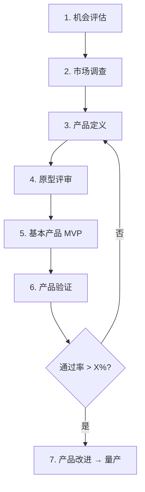

#### 关键参数表

| 步骤 | 关键问题 | 推荐时长 | 通过率红线 |
|---|---|---|---|
| 1. 机会评估 | 9 问题（产品价值 / 目标受众 / 市场规模 / 收益 / 竞争 / 优势 / 时机 / 营销 / 解决方案） | 1-2 天 | – |
| 2. 市场调查 | 6 问题（谁用 / 怎么用 / 障碍 / 为何选 / 喜欢什么 / 改进什么） | 1 周 | – |
| 3. 产品定义 | 转化为原型文档 | 3-5 天 | – |
| 4. 原型评审 | 多角度评审团（总经理+研发+市场+销售+生产+QA） | 1 天 | 7/8 同意才推进 |
| 5. MVP | 最低成本 + 可行 + 最快放市场 | 2-4 周 | – |
| 6. 产品验证 | 真实用户测试 | 1-2 周 | **> 60% 通过**（华为案例 5/50 = 10% 被否） |
| 7. 产品改进 | 不要照单全收用户要求 | 1-2 周 | – |

#### AI 化建议

- **PM 思维模拟 Agent**：让 LLM 扮演 4-5 种典型用户角色（runner / parent / commuter / home cook / handyman），跑每个场景的用户旅程，自动标出"凑合 / 将就"位
- **3W1H 框架**：每个新品定义阶段，强制 Agent 回答 What / Why / Who / How 四问 → 不全的不推进
- **KANO + 马斯洛模型**：每个产品 spec 打分（基础 / 期望 / 兴奋 / 反向）+ 满足马斯洛哪一层

#### 典型案例

- **华为电话语音系统**：50 个用户测试 5 个完成 = 10% 通过 → 项目被否（这是 MVP 验证最重要的反例）

#### 风险与反例

- ⚠️ **3 大思维误区**：拍脑袋 / 磕参数 / 抄同行 —— 必须用 MVP 验证
- ⚠️ **"空白市场陷阱"**：完全空白的市场可能是因为没有需求，要警惕
- ⚠️ **硬件不能极致迭代**：和互联网产品不同，模具改一次几十万

---

### 5.4 C3.4 八维差异化矩阵

#### 触发条件
- 已有种子 ASIN 或种子类目
- 想枚举所有可能的差异化方向

#### 数据源

竞品关联流量（亚马逊"Frequently Bought Together"）+ 行业灵感库 + LLM brainstorm

#### 决策链路：8 维度并行 brainstorm

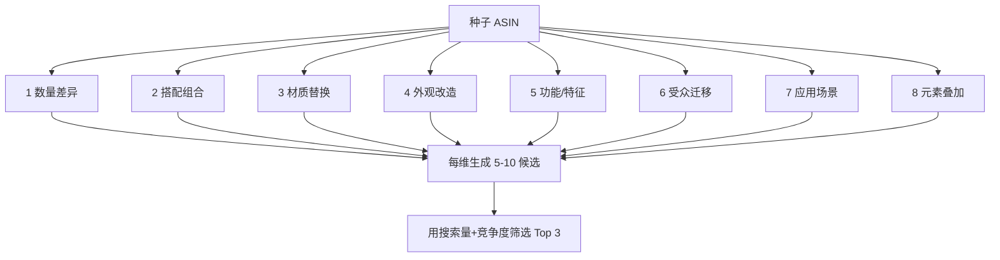

#### 关键参数表

| 维度 | 改造方向举例 | 风险点 | 优势 |
|---|---|---|---|
| 1. 数量 | 引流款+利润款搭配 | 头部垄断风险 | 增加客单 |
| 2. 搭配 | 午餐饭盒+刀叉+保温袋 | 套装 SKU 管理复杂 | 关联流量 |
| 3. 材质 | 玻璃→硅胶→竹子 | 开模成本 | 高溢价 |
| 4. 外观 | 经典款→Y2K 风 | 起订量大 | 高溢价 |
| 5. 功能 | 旅行版 / 一次性 | 专利风险 | 可申请专利 |
| 6. 受众 | 人 → 宠物 | 伪需求风险 | 蓝海 |
| 7. 场景 | 节日 / 露营 / 旅行 | 季节性 | 关键词蓝海 |
| 8. 元素 | + IP / + 卡通 / + 动漫 | IP 侵权 | 高溢价 |

**核心准则**：单维度差异化不够，**至少 2-3 维度组合**才能形成有效差异化。

#### AI 化建议

- **8 维 Brainstorm Agent**：输入种子 ASIN URL → LLM 自动跑 8 维度 → 每维度生成 5-10 候选改造 → 用 Helium 10 反查每个候选的搜索量、竞争度 → 输出"差异化雷达图"
- **2D-MIX Agent**：自动枚举所有 2 维组合（如材质×场景 = "户外金属饭盒"），优先级用关键词蓝海度排序

#### 典型案例

- **灭鼠先锋 Pop It**：基础款→水果形→篮球形→月亮形（外观 + 元素叠加）
- **耗油瓶**：经典款→尖叫饮料挤压瓶嘴（外观）
- **狗狗牙刷牙膏**：人用品→宠物（受众迁移）

#### 风险与反例

- ⚠️ **为差异化而差异化**：不要为了不同而不同，必须解决真实痛点
- ⚠️ **加功能影响整体性能**：改 spec 比加 spec 稳

---

### 5.5 C3.5 4.3 分分水岭分流（精品漏斗）

#### 触发条件
- 已锁定候选 niche
- 需要决定"做属性差异化"还是"做痛点改造"

#### 数据源

亚马逊前台评分 + review 文本

#### 决策链路：4.3 分分水岭

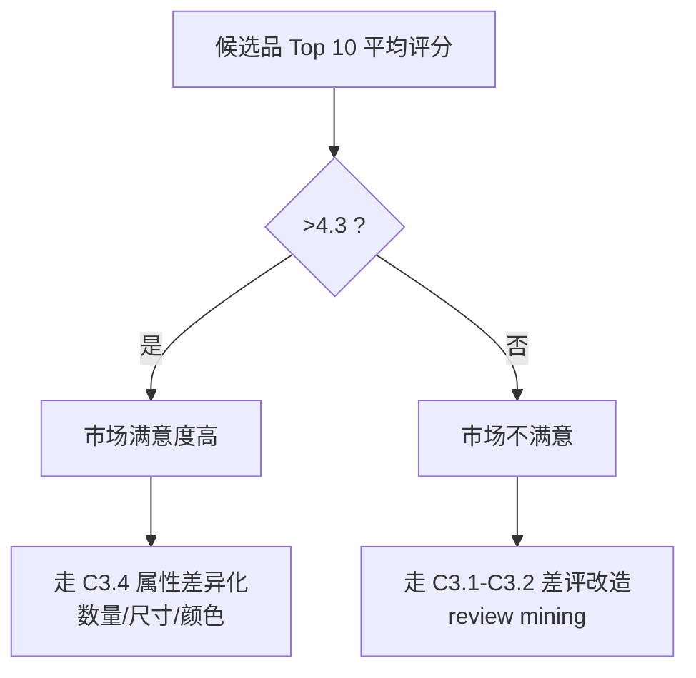

#### 关键参数表

| 参数 | 数值 | 来源 |
|---|---|---|
| 评分分水岭 | **4.3** | 内部「产品选品指标」xmind |
| > 4.3 → 属性差异化路径 | 数量 / 尺寸 / 颜色 / 包装 | – |
| < 4.3 → 痛点改造路径 | 升级 spec / 解决核心差评 | – |
| 测款节奏 | 初批 10 款 → 15-30 天筛 5 款 → 1 月再筛 2-3 款 | – |
| 目标毛利 | 40%（反推采购成本） | – |

#### AI 化建议

- 自动判定 Agent：输入 Top 10 ASIN URL → 自动算评分均值 → 输出"分流到属性差异化 Agent / 痛点改造 Agent"

#### 典型案例
- 充电器（评分均值 4.6） → 属性差异化（颜色 / 多接口数量）
- 老款除湿盒（评分均值 3.8） → 痛点改造（升级吸湿剂、防漏）

#### 风险与反例

- ⚠️ 评分均值不能反映长尾痛点 —— 即使 4.5 星，若 5% 差评集中在同一痛点（如"漏水"），仍要改

---

## 6. Cluster 4：品牌化爆款打造 (Brand-First Hit Building)

### 6.0 Cluster 哲学

**核心理念**：不是「先做产品再做品牌」，而是「**先想清楚要做什么品牌，再倒推该做什么产品**」。Anker 不是因为有充电器才有了品牌，而是因为定了"充电体验"品牌，所以每一款产品都符合这个故事。

**适用阶段**：2 → 100（已有 hero SKU 验证后开始矩阵扩张）

**Cluster 级 AI Agent 建议**：构建 **"Brand Strategist Agent"** —— 给定一个候选品，输出"如果做品牌应该怎么做"的 7 维报告（定位 / 复购属性 / Sidekick 矩阵 / 内容素材 / 社媒打法 / 独立站策略 / 长期护城河）。

---

### 6.1 C4.1 Sidekick 矩阵设计

#### 触发条件
- 已有 1 个验证有效的 hero SKU
- 想从单品扩展为品牌

#### 数据源

DTC 案例库（Anker / Vesync / Bombas / Dr. Squatch / Hims）+ 亚马逊"Frequently Bought Together"

#### 决策链路：Anker 充电生态范本

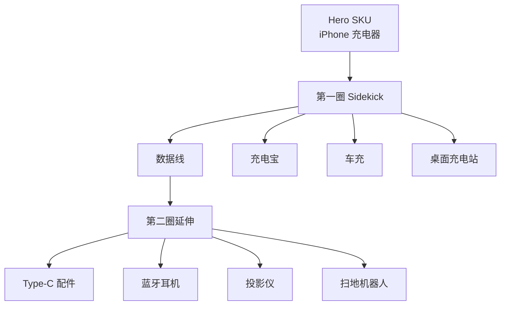

#### 关键参数表

| 参数 | 红线 | 健康区 | 极优区 | 置信度 | 来源 |
|---|---|---|---|---|---|
| Sidekick 数量（首年） | < 2 | 2-5 | 5-10 | 🟢 | Anker / DTC 案例 |
| 同品牌定位一致性 | 各 SKU 故事不一致 | 共享一个"使用场景" | 共享"用户身份"（如"通勤者"） | 🟢 | DTC SOTA |
| 关联购买率（Frequently Bought Together） | < 5% | 10-30% | > 30% | 🟡 | – |
| 品牌净推荐值 (NPS) | < 30 | 30-50 | > 50 | 🟢 | DTC SOTA |
| 长期复购率 | < 10% | 15-30% | > 30% | 🟢 | Yotpo 2026 |

#### AI 化建议

- **Sidekick Agent**：输入 hero SKU + 用户身份描述 → LLM 自动 brainstorm 50 个潜在 sidekick → 用关键词搜索量过滤到 Top 10
- **关联购买挖掘**：每周扫亚马逊"Frequently Bought Together"，发现新的关联模式

#### 典型案例

- **Anker**：充电器 → 数据线 → 充电宝 → 车充 → Eufy（扫地机）→ Soundcore（耳机）→ Nebula（投影仪）—— 共享"充电体验"延展到所有便携电子
- **Dr. Squatch**：男士肥皂 → 须后水 → 沐浴露 → 牙膏 → 共享"天然男士护理"身份

#### 风险与反例

- ⚠️ **盲目扩 SKU 稀释品牌**：SHEIN 这种铺货模式不适合做品牌护城河
- ⚠️ **Sidekick 之间互相竞争**：要分清"补充"vs"替代"

---

### 6.2 C4.2 复购属性筛选

#### 触发条件
- 选品阶段，希望优先选高复购属性产品

#### 数据源

类目复购率数据（Statista / Yotpo）+ 订阅渗透率统计 + 消耗速度估算

#### 决策链路

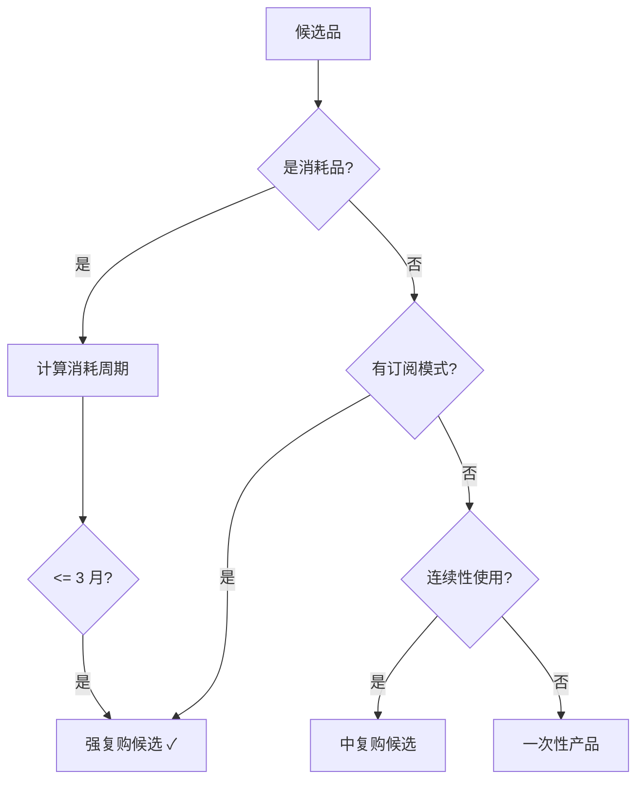

#### 关键参数表

| 参数 | 红线 | 健康区 | 极优区 | 置信度 | 来源 |
|---|---|---|---|---|---|
| 消耗周期 | > 12 月（一次性） | 3-6 月 | < 3 月（强消耗） | 🟢 | DTC SOTA |
| 订阅渗透率（同类品牌） | 0% | 15-30% | > 30%（LTV:CAC ×2-3） | 🟢 | Yotpo 2026 |
| LTV / CAC 比 | < 1 | 2-3 | > 3 | 🟢 | DTC SOTA |
| 复购窗口（首单后多久二单） | > 12 月 | 30-90 天 | < 30 天 | 🟢 | – |
| Subscribe & Save 折扣建议 | 不开启 | 5-10% | 10-15% | 🟡 | – |

#### AI 化建议

- **复购周期估算 Agent**：用 LLM 估算"日均使用频次 × 每次用量 × 包装量"= 平均使用周期
- **Subscribe-and-Save 模拟**：模拟 5% vs 10% vs 15% 三档折扣对 LTV 的影响

#### 典型案例

- **益生菌补剂**：30 天瓶装 → 强复购（每月）
- **宠物 calming chew**：28 天袋装 → 强复购
- **男士剃须刀片**：1-2 月一换 → 强复购
- **Bombas 袜子**：3-6 月换新 → 中复购

#### 风险与反例

- ⚠️ **认证类消耗品风险大**：食品 / 补剂 / 美妆需 FDA / FSC / EPA 认证，门槛高
- ⚠️ **物流损耗**：液体 / 易碎品消耗品物流退货率高

---

### 6.3 C4.3 三位一体（Amazon + 独立站 + 社媒）

#### 触发条件
- 已有亚马逊销售基础
- 希望建立品牌资产 + 独立流量

#### 数据源

亚马逊 / Shopify / Instagram / TikTok / Pinterest / Reels 数据 + Facebook Ads / TikTok Ads

#### 决策链路：三位一体角色分配

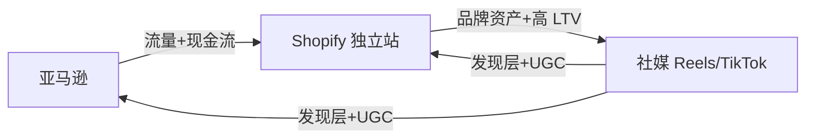

| 角色 | 平台 | KPI |
|---|---|---|
| **现金流引擎** | 亚马逊 | 月销售额、ACoS、转化率 |
| **品牌资产** | Shopify 独立站 | LTV、NPS、订阅渗透率 |
| **发现层** | Reels / TikTok | 视频播放量、CTR 到独立站 |

#### 关键参数表

| 参数 | 红线 | 健康区 | 极优区 | 置信度 | 来源 |
|---|---|---|---|---|---|
| Reels / TikTok 视频转化率 | < 0.5% | 1-2% | > 2% | 🟢 | Stack Influence 2026 |
| 独立站 vs 亚马逊毛利差 | < 0% | +10% | +20%（独立站更赚） | 🟢 | DTC SOTA |
| 社媒 → 独立站 CTR | < 1% | 2-5% | > 5% | 🟡 | – |
| 社媒电商占比目标 | < 10% | 30% | 53%+（DTC 平均） | 🟢 | Stack Influence |

#### AI 化建议

- **多平台内容自动化**：1 个种子产品视频 → LLM + AI 视频工具自动剪 5-10 个版本（不同 hook）→ 同时投 Reels / TikTok / YouTube Shorts
- **跨平台归因**：用 UTM + Shopify Pixel 跟踪每个视频的真实归因

#### 典型案例

- **Anker** 三位一体：Amazon 占 60% / 独立站 25% / 社媒发现 15%
- **Hims & Hers**：医疗订阅 + 独立站 + TikTok 教育内容

#### 风险与反例

- ⚠️ **独立站 ROI 低**：前 6 个月独立站可能净亏，需要长期投入
- ⚠️ **TikTok Shop 美国合规风险**：2025-2026 多次政策变动

---

### 6.4 C4.4 Hero SKU + Lean Launch

#### 触发条件
- 选品阶段，避免一次性铺多 SKU 失败
- 推荐用法：**第一年只做 1 个 Hero SKU，跑出 PMF 才扩**

#### 数据源

PMF 判定（Sean Ellis 测试 + 复购率 + NPS）

#### 决策链路

```mermaid
flowchart TD
    A[选 1 个 Hero SKU] --> B[首批 30-50 件]
    B --> C[Vine + 自然流量 1-2 月]
    C --> D{月销 > 200?}
    D -->|否| E[继续优化 listing 或换品]
    D -->|是| F[Sean Ellis 测试: "失去这个产品 你会失望吗?"]
    F --> G{失望率 > 40%?}
    G -->|否| H[继续打磨产品]
    G -->|是| I[PMF! 开始扩 Sidekick]
```

#### 关键参数表

| 参数 | 红线 | 健康区 | 极优区 | 置信度 | 来源 |
|---|---|---|---|---|---|
| 第一年 SKU 数 | > 5（资源分散） | 1-3 | 1（专注） | 🟢 | Lean Launch SOTA |
| Sean Ellis PMF 失望率 | < 20% | 40%+ | > 50% | 🟢 | Sean Ellis 框架 |
| Hero SKU 首批备货 | > 500（库存压力） | 100-300 | 30-100（Vine 测试） | 🟢 | 内部 #16 |
| Hero SKU 试销期 | < 1 月 | 2-3 月 | 3 月 | 🟢 | – |

#### AI 化建议

- **PMF 自动监测**：定时跑 Sean Ellis 调研 / NPS 调研，自动算分
- **Hero SKU 优先级 Agent**：给 5 个候选品打综合分（市场 + 利润 + 品牌契合度），输出"应该先做哪个"

#### 典型案例

- **Anker** 第一款充电器：从 1 个 SKU 跑到月销 50,000 才开始扩
- **Bombas** 第一款袜子：单 SKU 跑了 18 个月才出第二款

#### 风险与反例

- ⚠️ **过度耐心也是错**：3 个月还没破 100 单 → 大概率要换品
- ⚠️ **多 SKU 抢资源**：新人最大坑是一次铺 10 个 SKU，每个都不够预算推

---

### 6.5 C4.5 新品成长飞轮（2 阶段 7 环节官方版）

#### 触发条件
- 已选定品类，准备进入开发→上架→运营完整闭环
- 已注册亚马逊品牌

#### 数据源

亚马逊官方 4 工具：商机探测器 OX / 选品指南针 MPG / 增长机会 MYG / 品牌分析 ABA

#### 决策链路：飞轮 7 环节

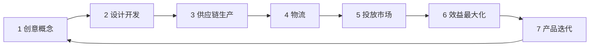

#### 关键参数表

| 参数 | 红线 | 健康区 | 极优区 | 公式 / 来源 |
|---|---|---|---|---|
| 成功新品定义 | – | – | 过去 30 天年化收入 > $50K | 飞轮 PDF |
| 成功新品概率 | – | – | 成功发布数 ÷ 已发布新品数 | 飞轮 PDF |
| **特征词搜索热度** | – | – | `(1 / 搜索频率排名) × 100,000` | 飞轮 PDF |
| **特定搜索词出单预估** | – | – | 商品点击数 × 搜索转化率 | 飞轮 PDF |
| Top 5 商品点击份额 | > 50%（垄断） | 20-30% | < 30% | 飞轮 PDF |
| Top 20 点击份额 | > 80% | 40-60% | < 60% | 飞轮 PDF |
| 退货率分级 | ≥ 15% | 5-15% | < 5% | 飞轮 PDF / Eightx |
| 评分分级 | ≤ 3.5 | 3.5-4.5 | ≥ 4.5 | 飞轮 PDF |
| 新品占比朝阳市场判定 | < 10% | 30-50% | > 50%（如 51%） | 飞轮 fall lights 案例 |
| **首批采购量公式** | – | – | `(采购周期 + 入库天数) × (备货天数 × 日均销量)` | 冷启动手册 |
| 备货库存周期 | < 1 月 | 2 月 | 2-3 月 | 飞轮 PDF |

#### 时间线案例（fall lights）

| 时间 | 动作 |
|---|---|
| 5/25 前 | 市场调研 / 开发设计 / 开模 / 供应链 |
| 5/25 | 小批量空运 |
| 6/1 | 大批量 FBA 海运 |
| 6/15 | 小批量上架 |
| 6/15-6/25 | 冷启动（Vine + SP + SB + SBV） |
| 6/25 | 旺季预热（+SD + DSP） |
| 7/1-12/20 | 旺季（+Deal + Coupon） |

#### AI 化建议

- **OX MPG MYG ABA 数据 Agent**：4 工具 API 拉数据合并，自动算"特征词搜索热度"、"出单预估"
- **飞轮自动化**：把 7 环节做成 7 个独立 Agent，由 Orchestrator 调度

---

### 6.6 C4.6 新品冷启动铁三角（备货 / 详情页 / 运营）

#### 触发条件
- 新品已上架，准备做冷启动 30-90 天

#### 数据源

亚马逊 Listing 后台 + 广告管理后台 + Vine 评论 + 库存管理 + 容量管理器

#### 决策链路：3 阶段递进

```mermaid
flowchart TD
    A[阶段一 备货]
    A --> A1[首批采购量公式]
    A --> A2[设 0 库存利用扶持期再切正常]
    A --> A3[库存维持 2-3 月]

    B[阶段二 详情页]
    B --> B1[类目节点准确]
    B --> B2[主图吸睛]
    B --> B3[A+/视频/QA 完整]

    C[阶段三 运营推广]
    C --> C1[自动广告+促销]
    C --> C2[Vine 绿标评论]
    C --> C3[品牌引流奖励]
```

#### 关键参数表（与 C4.5 重叠的不重复，只列冷启动专有）

| 参数 | 红线 | 健康区 | 极优区 | 来源 |
|---|---|---|---|---|
| 主图视图数 | < 4 | 6-7 | 7（饱和） | – |
| A+ 模块数 | < 3 | 5-7 | 7 (高级 A+) | 飞轮 |
| Vine 评论目标（前 30 天） | < 3 | 10-20 | 20-30 | 冷启动手册 |
| 自动广告 ACoS（前 14 天） | – | 50-80% | 30-50%（已有竞争力） | – |
| 测评成本（前 30 天） | – | ≤ 售价 × 20% | ≤ 售价 × 15% | – |
| 容量利用率 | > 100%（超限） | 70-90% | 70-80% | – |

#### AI 化建议

- **三 Agent 编排**：库存监控 Agent + 详情页质量评分 Agent + 广告优化 Agent，三者数据共享
- **listing 质量自动评分**：用 SOTA listing scorer（Helium 10 / Jungle Scout）+ 自研 LLM 评分综合

---

## 7. Cluster 5：供应链反推 (Supply-Chain Reverse)

### 7.0 Cluster 哲学

**核心理念**：「从工厂往亚马逊看」而非「从亚马逊往工厂看」。中国卖家的最大优势是**供应链效率 + 低 BOM 成本**。供应链反推不是策略，是天然的护城河。

**适用阶段**：贯穿全阶段，但尤其在初创团队（有工厂关系）和扩张期（多 SKU 矩阵）

**Cluster 级 AI Agent 建议**：构建 **"Supply Chain Agent"** —— 输入产业带 / 工厂样品库 / 1688 链接 → 输出"这些供应能力对应到亚马逊哪些可做的细分品类 + 利润反推"。

---

### 7.1 C5.1 1688 产业带反查

#### 触发条件
- 团队成员熟悉某个产业带（如义乌小商品、广东 3C、深圳跨境）
- 想用工厂源头价做差异化定价

#### 数据源

| 平台 | 接入方式 | 关键字段 |
|---|---|---|
| 1688 | 爬虫 / API（受限） | 产品图、起订量、价格、地址、销量、配套服务 |
| 阿里国际站 | API | 海外询盘量、出货国家 |
| 工厂直接对话 | 微信 / 展会 | 现货 / 改模 / OEM/ODM 能力 |

#### 决策链路

```mermaid
flowchart TD
    A[选定 1688 产业带] --> B[搜核心关键词]
    B --> C[筛选 月销 1,000+ 工厂]
    C --> D[反查这些产品对应的<br/>Amazon 关键词]
    D --> E[Amazon 验证: BSR/月销/价格]
    E --> F{价格差 > 5x?}
    F -->|是| G[选定 + 谈判]
    F -->|否| H[价差不够 跳过]
```

#### 关键参数表

| 参数 | 红线 | 健康区 | 极优区 | 置信度 | 来源 |
|---|---|---|---|---|---|
| 1688 → Amazon 价差倍数 | < 3× | 5-8× | 8-15× | 🟢 | 内部 #9 |
| 工厂起订量（首单） | > 5,000 | 500-2,000 | 100-500 | 🟢 | 内部 #16 |
| 工厂 1688 月销 | < 100 | 1,000-10,000 | > 10,000 | 🟢 | – |
| 工厂自有图片 vs 通用图片 | 通用图（货比三家陷阱） | 自有 | 自有 + 视频 | 🟡 | – |
| 工厂配套（包装 / 丝印） | 仅出货 | 含基础包装 | 含 OEM 包装 / Logo | 🟢 | – |

#### AI 化建议

- **1688 反查 Agent**：输入产业带分类 → 用爬虫抓 Top 工厂 → LLM 翻译产品名 → Amazon 反向搜索 → 输出"价差 + 月销 + 入场难度"打分卡
- **多语言能力**：DeepSeek 案例里给了完整代码，建议团队复用

#### 典型案例

- **植物支架 plant stand**（DeepSeek 案例）：从园艺工具 → 植物支架 → 1688 找 10 家供应商 → 谈判控制采购成本 25-40%
- **义乌饰品**：手链 1688 价 ¥3 → Amazon $9.99 → 8× 价差

#### 风险与反例

- ⚠️ **工厂质量不稳定**：1688 上的"小厂"经常换 BOM，质量波动大
- ⚠️ **MOQ 陷阱**：图便宜下单 500 件，可能积压
- ⚠️ **专利风险**：1688 上很多产品本身已侵权，必须做 FTO

---

### 7.2 C5.2 大型展会 + 工厂对话

#### 触发条件
- 团队有展会预算（广交会 / CES / 香港礼品展 / 法兰克福消费品展）
- 想发现"还没出现在线上"的供应链能力

#### 数据源

展会名录 + 现场对话 + 工厂样品

#### 决策链路（与传统选品不同）

```mermaid
flowchart TD
    A[展会] --> B[现场对话工厂销售]
    B --> C[评估: 客户素质]
    C --> D[评估: 销售专业度]
    D --> E[索要样品 + BOM]
    E --> F[回去 Amazon 反查市场]
    F --> G{已有市场?}
    G -->|是| H[复制策略]
    G -->|否| I[蓝海机会! 但风险高]
```

#### 关键参数表

| 参数 | 推荐 | 来源 |
|---|---|---|
| 参展频次 | 2-4 次/年 | – |
| 重点关注的展会 | 广交会 / CES / 法兰克福消费品 / Ambiente / 香港礼品展 / Hong Kong Electronics Fair | 内部 #3 |
| 优质工厂指标 | 有 50%+ 客户卖给亚马逊；销售可英文沟通；提供 OEM/ODM | 内部 #3 |

#### AI 化建议

- **展会名录 AI 抓取**：抓所有参展企业的官网 + 主营产品，反向匹配现有 Amazon 类目
- **样品图片 vision 分析**：用 GPT-4V / Claude Vision 自动分析样品图片 → 与亚马逊现有 listing 视觉对比

#### 风险与反例

- ⚠️ **展会主推产品 = 公模产品**：很多展会展品已经被无数卖家在卖
- ⚠️ **私模产品需 NDA**：好的私模通常工厂会签 NDA，不能告诉别家

---

### 7.3 C5.3 私模开模差异化

#### 触发条件
- 已有验证 hero SKU
- 想从公模升级到私模建立护城河

#### 数据源

工厂报价 + 模具厂报价 + 专利数据库

#### 关键参数表

| 参数 | 红线 | 健康区 | 极优区 | 来源 |
|---|---|---|---|---|
| 模具成本（小件） | < ¥30K（质量差） | ¥50K-¥200K | ¥100K+（精密件） | – |
| 模具成本（大件） | < ¥100K | ¥200K-¥500K | ¥300K-¥1M | – |
| 模具回本周期 | > 24 月（风险大） | 6-12 月 | 3-6 月 | – |
| 改模成本（公模改私模） | > 60% 总价 | 30-50% | 10-30% | – |
| 起订量（私模） | > 10,000 | 3,000-5,000 | 1,000-3,000 | – |

#### AI 化建议

- **模具 ROI 计算 Agent**：输入模具成本 + 预估月销 + 单件毛利 → 输出回本周期 + 风险等级

#### 风险与反例

- ⚠️ **专利侵权**：模具开了再发现侵权 → 全部废
- ⚠️ **工厂占用模具**：很多工厂"包销 + 不另卖"承诺并不可靠

---

### 7.4 C5.4 6 步供应商评估

#### 触发条件
- 已选定品类，开始评估 5-10 家潜在供应商

#### 决策链路：6 步评估

```mermaid
flowchart LR
    A[1 样板申请] --> B[2 测试样品]
    B --> C[3 普货测试: 包装/防摔/防水]
    C --> D[4 带电带磁测试: 通电/磁吸/使用]
    D --> E[5 测量重量/尺寸/包装]
    E --> F[6 综合评分: 6 维度]
```

#### 关键参数表

| 6 维度 | 评分 | 权重 |
|---|---|---|
| 样品质量 vs 市面 | 高于 +5 / 一致 / 低于 -10 | 25% |
| 样板费 / 是否现货 | 免费现货 +5 / 付费 / 拒绝 | 10% |
| 打样时间 | < 7 天 +5 / 7-14 / > 14 | 15% |
| 下单退样板费 | 是 +5 / 部分 / 否 | 10% |
| OEM/ODM 能力 | 完整 ODM +10 / OEM / 仅贴牌 | 25% |
| 工厂规模 | > 100 人 / 50-100 / < 50 | 15% |

#### AI 化建议

- **供应商评分 Agent**：6 维度结构化打分 + LLM 提取销售对话中的"风险信号"

---

### 7.5 C5.5 首批采购量公式

#### 触发条件
- 已选定 hero SKU，准备首批下单
- 需要平衡资金占用 vs 缺货风险

#### 公式

**首批采购量 = (采购周期 + 入库天数) × (备货天数 × 日均销量)**

具体例子：
- 采购周期 30 天 + 入库天数 15 天 = 45 天补货周期
- 备货天数 60 天 + 日均销量 10 单 = 600 单/月
- 首批 = 45 × (60 × 10 / 30) = 45 × 20 = **900 单**

#### 关键参数表

| 参数 | 推荐 | 来源 |
|---|---|---|
| 采购周期（普货） | 20-30 天 | 内部 #16 |
| 采购周期（带电 / 私模） | 45-60 天 | – |
| 入库天数（海运） | 30-45 天 | 内部 #14 |
| 入库天数（空运） | 7-15 天 | 内部 #14 |
| 备货天数 | 60-90 天 | 内部 #16 / 飞轮 |
| 安全库存乘数 | 1.2-1.5× | – |

#### AI 化建议

- **库存 Agent**：实时监控库存 vs 销量 → 自动算"再下单 trigger"，避免人工拍脑袋

---

### 7.6 C5.6 精铺 vs 精品双模式分流

#### 触发条件
- 团队资金 / 供应链能力评估之后选择模式

#### 决策链路

```mermaid
flowchart TD
    A[评估团队资源] --> B{资金<br/>+ 供应链能力}
    B -->|< $50K + 无工厂关系| C[精铺模式]
    B -->|$50K-$200K + 部分供应链| D[精品 + 部分私模]
    B -->|> $200K + 强供应链| E[全私模 + 品牌化]
    C --> C1[公模微改<br/>SKU 8-12<br/>开发周期 < 1 月]
    D --> D1[半私模<br/>SKU 3-5<br/>开发周期 1-3 月]
    E --> E1[全私模 + 模具<br/>SKU 1-3<br/>开发周期 3-6 月]
```

#### 关键参数表

| 维度 | 精铺 | 半精品 | 精品 |
|---|---|---|---|
| 单 SKU 投入 | < $5K | $5K-$30K | > $30K |
| 总 SKU 数（首年） | 8-12 | 3-5 | 1-3 |
| 开发周期 | < 1 月 | 1-3 月 | 3-6 月 |
| 货源 | 1688 / 老供应商 | 半 ODM | 全 ODM + 私模 |
| 利润率目标 | 20-30% | 30-40% | 40%+ |
| 退出难度 | 低 | 中 | 高（已投模具） |

#### AI 化建议

- **资源评估 Agent**：自动问 5 个团队问题（资金 / 供应链 / 经验 / 风险偏好 / 时间），输出推荐模式

---

## 8. Cluster 6：趋势 / 节奏 / 渠道反向 (Trend Timing & Off-platform Discovery)

### 8.0 Cluster 哲学

**核心理念**：亚马逊数据是「滞后指标」（产品已经在卖了），社媒 + 独立站 + 众筹 + Google Trends 是「先行指标」。从平台外发现机会，再回平台验证 + 落地，是最 alpha 的路径。

**适用阶段**：0.1 → 5，尤其适合 Trend-Hopping 战术

**Cluster 级 AI Agent 建议**：构建 **"Trend Hunter Agent"** —— 多渠道并行监测（TikTok / Pinterest / Kickstarter / Shopify / Google Trends），每周输出"早期信号"报告。

---

### 8.1 C6.1 季节性产品法（三工具交叉判定）

#### 触发条件
- 已锁定品类，需要判断季节性强度
- 决定备货时间窗

#### 数据源

| 工具 | 用途 |
|---|---|
| Softime 插件 | 看产品级别销量历史 12 月分布 |
| 卖家精灵 | 类目级别历史销量 |
| Google Trends | 关键词搜索 5 年趋势 |

#### 决策链路

```mermaid
flowchart TD
    A[候选品] --> B[三工具同时跑 12 月趋势]
    B --> C[3 工具一致?]
    C -->|是| D[强季节性，按时间窗布局]
    C -->|否| E[模糊，建议跳过]
    D --> F[淡旺季比 < 2x = 适合]
    D --> G[淡旺季比 > 4x = 风险大]
```

#### 关键参数表

| 参数 | 红线 | 健康区 | 极优区 | 来源 |
|---|---|---|---|---|
| 淡旺季峰谷比 | > 4× | 1.5-2× | < 1.5× | SOTA |
| 旺季持续时长 | < 1 月（窗口太短） | 3-6 月 | 6 月以上 | – |
| 旺季备货倒推（圣诞） | 11/25 已最晚 | 10/15 前完成 | 9/30 前完成 | 内部 #3 |
| 季节性产品现金占用 | > 6 月（一年中只赚旺季） | 3 月 | 2 月（淡季能去库存） | – |

#### AI 化建议

- **季节性自动判定**：跑 Fourier 变换看周期性，识别"年度峰"+"季度峰"
- **三工具一致性 Agent**：自动判定 3 个工具是否给出一致信号

#### 典型案例

- **泳装**：美国 5-7 月旺、澳洲 9-1 月旺 → 提前 2-3 月备货
- **fall lights**：6/15 上架 → 7/1-12/20 旺季 → 备货 6-9 月

---

### 8.2 C6.2 节日选品（圣诞 / 万圣 / 情人节 / 母亲节）

#### 触发条件
- 临近节日 4-6 月（备货窗口期）

#### 数据源

亚马逊节日榜 + Google Trends 历史 5 年 + Pinterest（节日 DIY 趋势先行）

#### 决策链路 + 备货倒推

```mermaid
flowchart LR
    A[圣诞 12/25] --> B[海运 80 天前: 10/6]
    A --> C[FBA 入库前置 7 天: 10/13]
    A --> D[上架前 30 天: 11/25]
    A --> E[备货应于 9/30 前完成]
```

#### 关键参数表

| 节日 | 备货应完成 | 旺季时间窗 | 来源 |
|---|---|---|---|
| 圣诞 12/25 | 9/30 | 11 月初-12/20 | 内部 #3 |
| 万圣 10/31 | 7/31 | 9 月初-10/25 | – |
| 情人节 2/14 | 11/30 | 1/15-2/10 | – |
| 母亲节 5 月第二个周日 | 2/28 | 4/15-5/5 | – |
| 父亲节 6 月第三个周日 | 3/31 | 5/15-6/15 | – |

#### 风险与反例

- ⚠️ **节日产品库存清不掉**：圣诞袜 12/26 后只能 80% 折扣甩
- ⚠️ **节日 IP 侵权**：圣诞老人 / 复活节兔子 / 万圣节南瓜可能涉及商标

---

### 8.3 C6.3 热点选品（奥运 / 政治 / 世界杯 / 疫情 / 电影）

#### 触发条件
- 已知未来 6-12 月有重大事件（奥运、世界杯、大选）
- 团队可以快速决策 + 备货

#### 决策链路

```mermaid
flowchart TD
    A[预测事件: 巴黎奥运 2024<br/>洛杉矶奥运 2028] --> B[搜索同类历史<br/>东京 2020/伦敦 2012]
    B --> C[识别 5-10 个相关品类]
    C --> D[1688 找现成供应]
    D --> E[提前 2-3 月备货]
    E --> F[事件爆发期 1-2 月集中收割]
    F --> G[事件结束快速清库存]
```

#### 关键参数表

| 参数 | 推荐 | 来源 |
|---|---|---|
| 备货量（保守） | 估算量 × 60% | – |
| 备货量（激进） | 估算量 × 120% | – |
| 上架时间 | 事件前 1-2 月 | 内部 #3 |
| 清库存截止 | 事件后 1 月 | – |

#### 典型案例

- **东京奥运 2021/7/23-8/8**：奖牌 / 国旗 / 运动 / 玩偶 5 类爆发
- **BAYC 无聊猿 NFT 2021**：周边 T 恤、卡套（侵权风险高）

#### 风险与反例

- ⚠️ **政治产品风险极高**：可能因平台政策被下架
- ⚠️ **NFT/IP 侵权一旦被告倒赔**

---

### 8.4 C6.4 社媒选品（TikTok / Instagram / Pinterest / BigSpy / FindNiche）

#### 触发条件
- 持续运营的常态化机制（每周扫描）

#### 数据源

| 平台 | 接入方式 | 用途 |
|---|---|---|
| **TikTok Creative Center** | Web | 美国地区热门视频 / 标签 / 广告 |
| **BigSpy** | API | 全网广告创意（FB / IG / TikTok） |
| **FindNiche** | API | 速卖通 + Shopify 数据 |
| **Pinterest Trends** | API | 季节性视觉趋势 |
| **Instagram #Hashtag** | Web | UGC 内容趋势 |

#### 决策链路

```mermaid
flowchart TD
    A[TikTok 美国区 #fyp] --> B[抓 Top 100 视频<br/>商品标签]
    B --> C[过滤 Daily View > 500K]
    C --> D[Amazon 反查同款]
    D --> E{亚马逊已饱和?}
    E -->|否| F[早期机会 ✓]
    E -->|是| G[已晚期 跳过]
```

#### 关键参数表

| 参数 | 红线 | 健康区 | 极优区 | 来源 |
|---|---|---|---|---|
| TikTok 视频播放量门槛 | < 100K | 500K-5M | > 5M | – |
| Pinterest Pin 互动 | < 1K | 10K-100K | > 100K | – |
| FindNiche 月销 | < 100 | 500-5000 | > 5000 | – |
| 社媒首发 → Amazon 复制时间窗 | > 3 月（已晚） | 1-2 月 | < 1 月（最快） | – |

#### AI 化建议

- **TikTok Shop 监控 Agent**：每天扫 TikTok Shop 美区热销榜单 → 与 Amazon 反查 → 输出"未饱和"机会清单
- **创意素材 LLM 总结**：Top 100 视频 → LLM 提取共同卖点 / 钩子 / 痛点

#### 典型案例

- **冰盐水壶**（2024 TikTok 爆款）：先在 TikTok 火 → 1 个月内 Amazon 爆款
- **Sleep Mask Bonnet**（K-beauty）：Instagram 美容博主带火 → Amazon

#### 风险与反例

- ⚠️ **TikTok Shop 美区政策风险**：2025 多次政策调整
- ⚠️ **快进快出**：很多社媒爆款生命周期 < 3 月

---

### 8.5 C6.5 独立站 + 众筹（Shopify 爆款 / Kickstarter / Indiegogo）

#### 触发条件
- 想找"还没回流到亚马逊"的早期产品

#### 数据源

| 平台 | 用途 |
|---|---|
| Kickstarter | 创意产品 + 早期用户验证 |
| Indiegogo | 同上 |
| Product Hunt | 科技 / SaaS（也包含硬件） |
| Shopify 公开榜 | DTC 独立站爆款 |
| FindNiche / SaleSamurai | 独立站爆款数据库 |

#### 关键参数表

| 参数 | 红线 | 健康区 | 极优区 | 来源 |
|---|---|---|---|---|
| Kickstarter 筹资金额 | < $50K | $100K-$1M | > $1M（已被验证） | – |
| Kickstarter 支持人数 | < 1,000 | 5,000-50,000 | > 50,000 | – |
| Shopify 独立站月 GMV | < $10K | $100K-$1M | > $1M | – |

#### 风险与反例

- ⚠️ **众筹产品大量未交付**：Kickstarter 30% 项目无法兑现，不要复制还没发货的产品

---

### 8.6 C6.6 线下转线上趋势

#### 触发条件
- 团队希望从线下零售（Costco / Target / Best Buy 等）找尚未被亚马逊充分覆盖的品类

#### 决策链路（4 维度判断）

```mermaid
flowchart TD
    A[线下热门品] --> B{是否满足 4 个条件?}
    B --> B1[1 价格差 > 50%]
    B --> B2[2 功能补充]
    B --> B3[3 外观补充]
    B --> B4[4 品牌补充]
    B1 & B2 & B3 & B4 --> C{至少 2 个满足?}
    C -->|是| D[线下转线上机会 ✓]
    C -->|否| E[跳过]
```

#### 关键参数表

| 参数 | 红线 | 健康区 | 极优区 | 来源 |
|---|---|---|---|---|
| 线下 vs 线上价格差 | < 30% | 50-200% | > 200% | 内部 #6 |
| 线上同类产品数 | > 1000（饱和） | 100-1000 | < 200 | – |

#### 典型案例

- **Major Appliances / Furniture / Pet Products / Bath & Kitchen**（线下强但线上空间还大）
- **Best Buy 电子配件** → 线下 $30 在 Amazon 卖 $15 → 价格优势

---

### 8.7 C6.7 35 个垂直电商网站资源池

#### 数据源（按 7 大类目分类，详见附录）

- **家居**：lnt.com / collectionsetc.com / novica.com / pier1.com / pullsdirect.com
- **化妆**：saksfifthavenue.com / macys.com / sephora.cn
- **母婴**：gymboree.com / diapers.com / potterybarnkids.com / justkidsstore.com / albeebaby.com
- **新奇特**：ShutUpAndTakeMyMoney / ThisIsWhyImBroke / UncommonGoods / Firebox / The Grommet / Hammacher Schlemmer / The Awesomer / Awesome Stuff to Buy / Dude I Want That / The Green Head / Odditymall / Cool Things

#### AI 化建议

- 把这 35 站做成 RSS / 爬虫池，每周自动抓新品并 LLM 总结

---

## 9. Cluster 7：AI / COSMO 原生选品 (AI-Native Selection · 2026 哈佛差异化护城河)

### 9.0 Cluster 哲学

**核心理念**：**这是 2026 年才出现的新维度**。亚马逊在 2025-2026 部署了 COSMO（语义购物图谱）和 Rufus（AI 购物助手），目前 **20% 的 Amazon 流量经 AI 媒介**，**Rufus 用户的转化率比传统搜索高 60%**。「能被 AI 推荐」已经成为新的选品维度，而绝大多数现有方法论还没有覆盖。

**适用阶段**：2026 全阶段贯穿；每个 cluster 产出的候选都要通过 C7 过滤

**为什么这是哈佛团队的护城河**：
1. **领先性**：行业 SOTA 仅 ZonGuru 推出了"Rufus Readiness Report"，其他工具还没跟进
2. **AI 能力优势**：哈佛 AI/数据团队天然适合做多模态 embedding、跨类目迁移、因果推断
3. **窗口期短**：18-24 个月，等所有人都开始做后红利消失

**Cluster 级 AI Agent 建议**：构建 **"COSMO Readiness Classifier"** —— 输入候选品 + 当前 top listing 文本 / 图片 / 视频 → 输出"能否在 Rufus 时代被推荐"概率。

---

### 9.1 C7.1 COSMO Readiness 判别

#### 触发条件
- 任何 cluster 产出的候选品最终都要通过这关
- 这是一个 **"是否上品" 的过滤器**，而非起点

#### 数据源

- 亚马逊前台 listing 全文（标题 / 五点 / 描述 / A+ / Backend）
- review 文本（与 claim 一致性比对）
- QA 数量与质量
- ZonGuru Cosmo/Rufus Readiness Report（仅 ZonGuru 用户）

#### 决策链路：3 维 COSMO Readiness 评分

```mermaid
flowchart TD
    A[候选品 + 候选 listing 蓝图] --> M1[1 use-case 明确度]
    A --> M2[2 claim-review 一致性]
    A --> M3[3 Q&A 富度]

    M1 --> S1{是否能明确命名<br/>使用群体 + 场景?}
    S1 -->|是| P1[+10 分]
    S1 -->|否| N1[-10 分]

    M2 --> S2{claim 与历史 review<br/>是否一致?}
    S2 -->|是| P2[+10 分]
    S2 -->|矛盾大| N2[-30 分]

    M3 --> S3{现有竞品 QA<br/>能否生成 30+ 高质量?}
    S3 -->|是| P3[+10 分]
    S3 -->|否| N3[-5 分]

    P1 & N1 & P2 & N2 & P3 & N3 --> R[COSMO Readiness Score]
```

#### 关键参数表

| 参数 | 红线 | 健康区 | 极优区 | 置信度 | 来源 |
|---|---|---|---|---|---|
| Use-case 明确度（LLM 评分） | < 0.3 | 0.5-0.8 | > 0.8 | 🟢 | Velocity Sellers 2026 |
| Claim-Review 矛盾率 | > 20%（如"防水"但 30 条 review 说漏水） | < 10% | < 5% | 🟢 | BellaVix 2026 |
| QA 可生成数量 | < 10 | 20-50 | > 50 | 🟢 | ZonGuru |
| 用户群体命名（如 "runners" "parents"） | 通用品 | 1 个清晰群体 | 多用户群细分 | 🟢 | Velocity Sellers |
| ZonGuru Rufus Readiness | Low | Medium | High | 🟢 | ZonGuru |

#### AI 化建议

- **3 维评分 Agent**：用 Claude / GPT-4o 对每个候选 listing 做 3 维度评分
- **claim-review 矛盾检测**：抓 listing 中所有 claim → 与 review 全文做 NLI（自然语言推理）→ 计算矛盾率
- **QA 模拟生成**：LLM 模拟 50 个潜在买家问题 → 评估 listing 是否能回答

#### 典型案例

- **优秀案例**：「跑者专用防漏运动水壶」→ use-case 明确（跑步）、用户群体清晰（跑者）、QA 富（材质 / 容量 / 防漏 / 清洗）
- **失败案例**：「多功能水杯」→ use-case 模糊、用户群体不清、Rufus 无法匹配查询

---

### 9.2 C7.2 Rufus-Friendly Listing 反推选品

#### 触发条件
- 选品阶段，希望优先选「有故事可讲、有参数可炫」的产品

#### 决策链路

```mermaid
flowchart TD
    A[候选品] --> B{产品类型}
    B -->|功能 / 技术型| C[Rufus 友好 ✓]
    B -->|纯审美 / 服装| D[Rufus 不友好]
    C --> E[有大量可数据化参数: 材质/容量/功率/防水级]
    E --> F[QA 自然富度高]
    F --> G[评估 + 选品 ✓]
```

#### 关键参数表

| 维度 | 红线 | 健康区 | 极优区 |
|---|---|---|---|
| 产品参数可数据化数 | < 3 | 5-10 | > 10 |
| 用户角色清晰度 | 通用 | 单角色 | 多角色细分 |
| 使用场景可枚举数 | < 2 | 3-5 | 5+ |
| 评论富度（500 字以上 review 占比） | < 5% | 15-30% | > 30% |

#### AI 化建议

- **listing 富度评分**：用 LLM 评估候选品 listing 的"参数信息密度"
- **避开"Rufus 黑名单"品类**：服装 / 鞋（高退货 + claim 难量化）、纯审美品（无 spec）

---

### 9.3 C7.3 多模态 Review Embedding 选品

#### 触发条件
- 哈佛团队具备 ML 能力
- 想做行业还没人做的"图文视频混合"选品分析

#### 数据源

review 文本 + review 图片 + review 视频 + Q&A + 产品主图 + 视频

#### 决策链路

```mermaid
flowchart LR
    A[全量 review] --> B[文本 embedding<br/>BGE-M3]
    A --> C[图片 embedding<br/>CLIP / SigLIP]
    A --> D[视频 embedding<br/>VideoMAE]
    B & C & D --> E[Late Fusion<br/>concat + 加权]
    E --> F[多模态聚类]
    F --> G[痛点簇 + 视觉证据]
    G --> H[选品 spec 蓝图]
```

#### 关键参数表（前沿工程实现）

| 参数 | 推荐 | 来源 |
|---|---|---|
| 文本 embedding | BGE-M3 / text-embedding-3-large | SOTA |
| 图片 embedding | SigLIP / CLIP ViT-L | SOTA |
| 视频 embedding | VideoMAE / Video-LLaVA | SOTA |
| Late Fusion 权重 | 文 0.5 + 图 0.3 + 视频 0.2 | 哈佛建议 |
| 聚类算法 | HDBSCAN / Hierarchical | SOTA |

#### AI 化建议

- **这是哈佛团队的差异化护城河方向之一**
- 业内 SOTA（VOC.AI, SmartScout）仍以文本为主，多模态尚未落地

---

### 9.4 C7.4 LLM Agent 自动 Pipeline（DeepSeek 7 步实战）

#### 触发条件
- 团队已有 LLM API（DeepSeek / Claude / GPT-4o）
- 想跑全自动选品流程

#### 决策链路：7 步全自动选品（DeepSeek 案例改造）

```mermaid
flowchart TD
    A[1 选市场<br/>LLM 给 4 候选类目] --> B[2 选产品<br/>LLM 给 20 候选品]
    B --> C[3 关键词验证<br/>卖家精灵反查]
    C --> D[4 数据下钻<br/>导出 Excel 分析]
    D --> E[5 评价分析<br/>LLM 提取痛点]
    E --> F[6 供应链挖掘<br/>1688 + LLM 谈判策略]
    F --> G[7 经营预测<br/>6 月销量 / 利润 / 风险]
```

#### 关键参数（DeepSeek 案例：园艺工具 → 植物支架）

| 参数 | 案例值 | 推荐区间 |
|---|---|---|
| 启动资金 | $50K | $30K-$200K |
| 毛利率 | 25-40% | > 30% |
| 价格区间 | $15-$50 | – |
| 销量 | 10-50/天 | 300-1,500 单/月 |
| 销售额 | $3K-$10K/月 | $5K-$25K/月 |
| 评分门槛 | ≥ 3.5 | 3.8-4.3 |
| 评分数门槛 | 100+ | – |
| FBA 运费占比 | < 15% | < 15% |
| 上架时间 | < 1 年 | 3-12 月 |
| 采购成本占售价 | 25-40% | < 30% |

#### AI 化建议

- **这是哈佛团队 MVP 的核心 demo**：选 1 个类目跑通 7 步全自动 pipeline
- 注意 **"AI 幻觉"** 风险：DeepSeek 等 LLM 会编造数据，必须用真实工具 API 校验

#### 典型案例

- **DeepSeek 选品 → 园艺工具 → 植物支架 → Trellises 子类**：4.4 评分 / 月销 5,133 / FBA 92% / 1 家工厂控本 → 完整全流程

---

### 9.5 C7.5 跨类目痛点迁移（哈佛特有护城河）

#### 触发条件
- 已有大量 review embedding 数据（≥10 个类目）
- 想找"邻接类目可迁移的成功 spec"

#### 决策链路

```mermaid
flowchart TD
    A[类目 X review 痛点] --> B[痛点 embedding]
    B --> C[在类目 Y review 中近似搜索]
    C --> D{近似度 > 0.85?}
    D -->|是| E[X 类目的解决方案<br/>可能迁移到 Y]
    D -->|否| F[无迁移机会]
    E --> G[评估 Y 类目市场空间]
    G --> H[选品蓝图: Y + X 的解决方案]
```

#### 典型案例

- **宠物水盆"防漏"痛点** → 迁移到 **人类水杯"防漏"** → 新品方向
- **儿童保温瓶"耐摔"痛点** → 迁移到 **成人户外水壶"耐摔"** 
- **耳机"麦克风风噪"痛点** → 迁移到 **运动头戴式"风噪"**

#### AI 化建议

- **哈佛核心方向**：训练一个跨类目共享 embedding 空间
- 这种迁移是 **行业 SOTA 还没有做的**，是真正的 alpha

---

### 9.6 C7.6 因果推断 spec 优化

#### 触发条件
- 已有大量历史 listing 改版数据
- 想知道"改了哪一项 spec 才能提升 CR"

#### 决策链路

```mermaid
flowchart LR
    A[历史 listing 改版数据库] --> B[Difference-in-Differences]
    B --> C[识别因果 effect: 增加防水 → CR + 12%]
    C --> D[新品 spec 蓝图<br/>按 effect 大小排序]
```

#### 关键参数表

| 参数 | 推荐 |
|---|---|
| 因果模型 | DiD / Synthetic Control / Causal Forest |
| 历史数据规模 | > 1000 listing 改版历史 |
| Treatment 定义 | spec 改造（增防水 / 加传感器 / 升级电池 等） |
| Outcome | CR 变化 / BSR 变化 / 评分变化 |

#### AI 化建议

- **这是哈佛团队第二个独家护城河**
- 业内还在用"A/B 测试 listing"，没人系统化做 spec 改造的因果效应估计

---

## 10. 跨 Cluster 综合参数 Cheat Sheet（红线 / 健康 / 极优 三档）

> 这是 AI Agent 可以直接消费的「硬过滤规则」。任何候选品先过这张表，红线触发即剔除。

### 10.1 市场维度

| 指标 | 红线 (Reject) | 健康区 (Healthy) | 极优区 (Excellent) | 置信度 |
|---|---|---|---|---|
| 月销单数（top ASIN） | < 300 或 > 5,000 | 300-1,000 | 500-1,500 | 🟢 |
| 月营收（top ASIN） | < $5K | $5K-$25K | $10K-$50K | 🟢 |
| 主关键词月搜索量 | < 3,000 或 > 30,000 | 6,000-10,000 | 8,000-15,000 | 🟢 |
| JS Niche Score | < 6 | ≥ 7 | ≥ 8 | 🟢 |
| BSR（主类目） | > 100,000 | < 50,000 | < 10,000 | 🟢 |
| 季节性峰谷比 | > 4× | < 2× | < 1.5× | 🟢 |
| Google Trends 近 12 月 | 持续下降 | 持平 / 上升 | 上升 > 30% | 🟢 |
| 新品占比（6 月内） | < 3% | > 5% | > 10% | 🟢 |

### 10.2 竞品维度

| 指标 | 红线 | 健康区 | 极优区 | 置信度 |
|---|---|---|---|---|
| Page-1 平均评论数 | > 5,000 | 100-1,000 | < 500 | 🟢 |
| 自家产品起步 review 目标 | – | ≤ 250-500 即可切入 | – | 🟢 |
| Listing Age（top）| 大量 < 6 月 = 不稳 | 1-3 年 | 1-2 年 | 🟢 |
| 点击集中度（top 3 占比） | > 70% | 40-60% | < 50% | 🟢 |
| 头部品牌占有率 | 单品牌 > 50% | < 30% | < 20% | 🟢 |
| 平均星级 | < 3.6 或 > 4.7 | 3.8-4.3 | 3.8-4.0 | 🟢 |
| 价格带 | < $15 或 > $100 | $20-$70 | $30-$70 | 🟢 |
| 4.3 分分水岭分流 | – | > 4.3 走属性差异化 | < 4.3 走痛点改造 | 🟢 |
| 跟卖数 | > 10 | 1-3 | 1（无跟卖） | 🟢 |

### 10.3 利润维度

| 指标 | 红线 | 健康区 | 极优区 | 置信度 |
|---|---|---|---|---|
| 净利率 | < 12% | 20-25% | 25-40% | 🟢 |
| Referral fee（多数类目） | – | 15% | 电子 8% | 🟢 |
| 头程 + FBA + 仓储 占售价 | > 40% | 25-35% | < 25% | 🟢 |
| 预期 ACoS | > 35% | 15-25% | < 20% | 🟢 |
| 最低售价 | < $15（被费率吃光） | $25+ | $30+ | 🟢 |
| 采购成本 / 售价 | > 40% | 25-35% | < 30% | 🟢 |
| 体积重 vs 实重 | 体积重 > 2× 实重 | 接近 | 实重 > 体积重 | 🟢 |
| Subscribe & Save 折扣 | – | 5-10% | 10-15%（LTV ×2-3） | 🟡 |

### 10.4 风险维度

| 指标 | 红线 | 健康区 | 极优区 | 置信度 |
|---|---|---|---|---|
| 退货率（多数类目） | ≥ 15% 或 > 类目阈值 | < 类目阈值 | < 5% | 🟢 |
| 服装 / 鞋类退货率阈值 | – | – | **退货率 0% 阈值（每单都收费）** | 🟢 |
| 重量 | > 20 lb（Large Standard） | < 20 lb | < 1 lb | 🟢 |
| 体积 | Overmax（> 96 in 或 > 130 in L+girth）扣 $17-25/单 | Standard | Small Standard <8×8×8 in | 🟢 |
| 专利 / 设计专利 | 未做 FTO 分析 → 拒 | 已 FTO 清除 | 自有 IP | 🟢 |
| Brand Registry | 2026 春起 FBA UPC 强制 | 已注册 | Trademark + Registry | 🟢 |
| 类目监管 | 食品/婴儿/医疗未取得资质 | 取得资质 = 护城河 | – | 🟢 |
| 燃料 / 液体 / 锂电 | 高风险审核 | – | 避开 | 🟢 |
| 季节性 | 单季 > 70% 销量 | 双季峰 | 全年均匀 | 🟢 |

### 10.5 时间窗维度

| 指标 | 红线 | 健康区 | 极优区 | 置信度 |
|---|---|---|---|---|
| 上架时间（top ASIN） | > 5 年（红海） | 1-3 年（增长期） | 6-12 月（朝阳） | 🟢 |
| 类目首次上架 | > 5 年（成熟期） | 1-3 年（增长期） | < 2 年（导入期） | 🟢 |
| 备货首批 | > 1000（占资金） | 300-500 | 30-100（Vine 测试） | 🟢 |
| 上架到首单 | > 14 天（listing 差） | 3-7 天 | < 3 天 | 🟢 |
| 上架到出 review | > 30 天 | 14-21 天 | < 14 天（Vine 配合） | 🟢 |
| 旺季备货倒推（圣诞） | < 11/25 已晚 | 10/15 前完成 | 9/30 前完成 | 🟢 |

### 10.6 品牌化维度

| 指标 | 红线 | 健康区 | 极优区 | 置信度 |
|---|---|---|---|---|
| 复购属性 | 一次性硬耐用品 | 半消耗 | 纯消耗品 / 订阅 | 🟢 |
| 复购周期 | > 12 月 | 3-6 月 | < 3 月 | 🟢 |
| Sidekick 矩阵潜力 | 无 | 2-3 个延伸 SKU | 5+ 矩阵 | 🟢 |
| 视频可演示性 | 静态产品 | 有功能演示点 | 戏剧化前后对比 | 🟢 |
| 订阅渗透目标 | 0% | 15%+ | 30%+ | 🟢 |
| LTV / CAC 比 | < 1 | 2-3 | > 3 | 🟢 |

### 10.7 AI / COSMO 维度

| 指标 | 红线 | 健康区 | 极优区 | 置信度 |
|---|---|---|---|---|
| Use-case 明确度 | 通用品 | 1 个清晰场景 | 多用户群细分 | 🟢 |
| Listing claim 与 review 一致性 | 矛盾率 > 20% | < 10% | < 5% | 🟢 |
| Q&A 富度潜力 | < 10 QA | 20-50 | > 50 | 🟢 |
| 参数可数据化数 | < 3 | 5-10 | > 10 | 🟢 |
| ZonGuru Rufus Readiness | Low | Medium | High | 🟢 |

---

## 11. 哈佛团队 AI 全链路 MVP 实施路径

### 11.1 阶段一：3 个月 MVP（验证 AI 选品能力）

**目标**：跑通 DeepSeek 案例的 7 步全自动选品 pipeline，上 1 个 Hero SKU。

| 周次 | 任务 | 产出 |
|---|---|---|
| W1-2 | 接入卖家精灵 / Helium10 / JS API；做特征工程 | 30 维候选池特征向量 |
| W3-4 | 实现 C1.1 工具大数据筛选 Agent + C1.4 10 维度调研 Agent | 100 → 20 候选池 |
| W5-6 | 实现 C3.1 review mining LLM 聚类 + C3.4 八维差异化矩阵 | 5 个候选品 + 改造蓝图 |
| W7-8 | 实现 C7.1 COSMO Readiness 评分 + C7.4 7 步 pipeline | 锁定 1 个 Hero SKU |
| W9-10 | 1688 供应链 + 私模评估 + 首批备货 | 首批 100 件已下单 |
| W11-12 | 上架 + 冷启动铁三角 | 首单 + 第一波 Vine |

### 11.2 阶段二：6 个月扩展（搭建 Cluster 间编排）

| 月份 | 任务 |
|---|---|
| M4 | C2 榜单复制 Agent + C6 趋势监测 Agent 上线 |
| M5 | C7.3 多模态 review embedding 工程实现 |
| M6 | C7.5 跨类目痛点迁移 Agent（哈佛护城河） |
| M7 | C5 供应链 Agent（1688 + 展会 RPA） |
| M8 | C4 品牌化飞轮：Sidekick 矩阵 → 扩 SKU |
| M9 | C7.6 因果推断 spec 优化（哈佛护城河） |

### 11.3 阶段三：12-24 个月规模化

- 每月自动产出 5-10 个新品候选 → 上 2-3 个新 SKU
- 单店长能完整链路运营品牌
- 扩展到独立站 + TikTok Shop（三位一体）

### 11.4 团队结构建议

```
┌─────────────────────────────────────────┐
│         Orchestrator Agent              │
│      （调度全 7 个 cluster agent）       │
└─────────────────────────────────────────┘
  │
  ├─ Discovery Agent (C1)
  ├─ Mimicry Agent (C2)
  ├─ Pain Miner Agent (C3)
  ├─ Brand Strategist Agent (C4)
  ├─ Supply Chain Agent (C5)
  ├─ Trend Hunter Agent (C6)
  └─ COSMO Readiness Classifier (C7)
```

**人员配置（哈佛团队）**：
- 1 × Tech Lead（PI 级别）
- 2 × AI Engineer（ML / LLM）
- 1 × Data Engineer（爬虫 / API / DB）
- 1 × Amazon 运营专家（提供 ground truth 反馈）
- 1 × 供应链 / 工厂 BD

---

## 12. 风险与反例库

### 12.1 选品环节常见 trap

| 陷阱 | 触发条件 | 规避方法 |
|---|---|---|
| **空白市场陷阱** | 完全无竞品的细分 | 警惕，可能没有需求；做 MVP 验证 |
| **快进快出热点** | M&S 突然上榜的新品 | 等 1-3 月观察 |
| **品牌垄断 > 50%** | 单品牌占类目 50%+ | 跳过或差异化打 |
| **服装 / 鞋类退货** | 退货率 0% 阈值（每单收费） | 谨慎入场 |
| **认证类目** | 食品 / 婴儿 / 医疗 / 化妆品 | 资质成本高，但护城河也大 |
| **专利侵权** | 1688 上未做 FTO | 必须查美专利 + 设计专利 |
| **季节性单峰** | 圣诞 / 万圣节 | 占资金 + 库存清不掉 |
| **AI 幻觉** | DeepSeek 编造数据 | 必须用真实工具 API 校验 |
| **小类排名高但大类低** | 小类 < 50 但大类 > 30,000 | 类目太小，月销可能 < 30 单 |
| **review > 2,000 的老品** | 评论壁垒已成 | 不要正面竞争 |

### 12.2 真实反例案例

- **指尖陀螺**（2017）：从 M&S 到 BSR 顶峰仅 3 月，崩盘后大量库存清不掉
- **Bath Rugs 浴室地毯**：品牌集中度 70%、平均月销虽高但全美本土卖家主导 → 中国卖家入场难
- **华为电话语音系统**：50 个测试用户仅 5 个通过 → MVP 验证否决，避免量产

---

## 13. 数据源与工具清单

### 13.1 必备工具（建议接入 API）

| 工具 | 用途 | 月费 | 重要性 |
|---|---|---|---|
| **Helium 10 Diamond** | Black Box / Cerebro / Magnet / Adtomic | $279 | ★★★★★ |
| **Jungle Scout Suite** | Opportunity Finder / Product Database / Listing Quality | $149 | ★★★★★ |
| **卖家精灵 SellerSprite** | ABA 反查 / 市场看板 / 蓝海词 | $99 | ★★★★★ |
| **Keepa** | 历史 BSR / 价格 / 评论曲线 | $19 | ★★★★★ |
| **ZonGuru** | Cosmo/Rufus Readiness Report（独家） | $49 | ★★★★ |
| **SmartScout** | 43K 子类 + AI Sentiment | $29-99 | ★★★★ |
| **VOC.AI** | review 维度化优缺点 | – | ★★★★ |
| **Sorftime** | 22+10 思路插件 | – | ★★★ |
| **AMZScout AI Review Analyzer** | review 自动摘要 | – | ★★★ |
| **Helium 10 Adtomic** | PPC AI 出价 | 含订阅 | ★★★★ |
| **Perpetua** | 算法竞价（target ACoS） | – | ★★★ |

### 13.2 数据爬取 / 增强

| 工具 | 用途 |
|---|---|
| **Apify / Bright Data** | review / Q&A 全量抓取 |
| **Google Trends API** | 关键词趋势 |
| **TikTok Creative Center** | 短视频热门标签 |
| **BigSpy** | 全网广告创意 |
| **FindNiche** | 速卖通 + Shopify 数据 |
| **Pinterest API** | 视觉趋势 |
| **1688 / Alibaba API** | 工厂供应链 |

### 13.3 AI 基础设施

| 组件 | 推荐 |
|---|---|
| Embedding 模型 | BGE-M3（中英） / text-embedding-3-large（英） |
| 图片 Embedding | SigLIP / CLIP ViT-L |
| 视频 Embedding | VideoMAE / Video-LLaVA |
| LLM 主模型 | Claude Sonnet 4.6 / GPT-4o / DeepSeek V3 |
| LLM 备用 | Claude Opus 4.6（高质量推理） |
| 向量数据库 | Pinecone / Weaviate / Qdrant |
| Agent 框架 | LangGraph / AutoGen / Claude Agent SDK |
| Workflow | n8n / Temporal / Airflow |

---

## 14. 附录 A：可复用打分公式

### A.1 七段式 33 项打分表（完整版，满分 ~100）

详细 33 项参数已在 §3.3 列出。核心判定公式：

```python
def seven_segment_score(item):
    score = 0
    # 1 产品供需分析
    if item.search_volume > 50000: score += 10
    elif item.search_volume > 30000: score += 5
    elif item.search_volume > 10000: score += 5
    if item.competition_count < 10000: score += 10
    elif item.competition_count < 30000: score += 5
    if item.competition_eq_demand: score += 5
    if item.competition_gt_demand: score -= 50  # 致命
    if item.rating > 4: score += 2
    elif item.rating < 3.6: score -= 10
    # 2 生命周期
    if item.no_low_season: score += 5
    if item.life_cycle > 1: score += 5
    if item.is_declining: score -= 50  # 致命
    if item.rank_decline_3m: score -= 20
    if item.rank_rise_3m: score += 2
    if item.price_crash_3m: score -= 30
    if item.daily_sales < 10: score -= 20
    # ... 共 33 项
    # 判定
    if score < 0: return "果断放弃"
    if score < 50: return "风险大"
    if score < 60: return "风险一般"
    if score < 80: return "风险低 ✓"
    return "强烈推荐 ✓✓"
```

### A.2 21 项 88 分制完整表

详见 §3.3，核心规则同样可写成 Python 函数。

### A.3 ABA 季度增量公式

```excel
=IF(B>C, IF(C>D, IF(D>E, "增量产品", ""), ""), "")
```

B / C / D / E 分别是 Q1 / Q2 / Q3 / Q4 排名。连续 4 季排名上升（数值变小）即增量产品。

### A.4 首批采购量公式

```python
def first_purchase_qty(lead_time, inbound_time, stock_days, daily_sales):
    cycle = lead_time + inbound_time  # 补货周期
    monthly = stock_days * daily_sales  # 月备货量
    return cycle * (monthly / 30)
```

### A.5 日销 RV 反推公式（帕拓逊式）

```python
def estimate_daily_sales(weekly_rv_count):
    return weekly_rv_count / 7 * 50  # 假设 50 单产生 1 个 review
```

### A.6 特征词搜索热度（飞轮 PDF）

```python
def feature_word_heat(search_rank):
    return (1 / search_rank) * 100000
```

### A.7 利润反推（多渠道多币种，AMZ 选品利润指标）

```python
def calc_profit(price_usd, fx_rate, cost_cny, freight_cny):
    revenue_cny = price_usd * fx_rate
    commission = revenue_cny * 0.15
    reserve = revenue_cny * 0.12  # 广告 7% + 退货 5%
    fx_loss = revenue_cny * 0.005  # 0.5% 汇损
    fba = AMZ_DELIVERY_FEE[country]  # 美 20 / 英 10 / 欧 38 / 加 30 / 墨 30 / 日 38
    profit = revenue_cny - commission - reserve - fx_loss - freight_cny - fba - cost_cny
    return profit, profit / revenue_cny  # 利润额, 利润率
```

---

## 15. 附录 B：术语对照表

| 中文 | 英文 | 含义 |
|---|---|---|
| 选品 | Product Research / Product Selection | 从市场找可做的产品 |
| 蓝海 | Blue Ocean | 低竞争高需求 |
| 红海 | Red Ocean | 高竞争 |
| BSR | Best Sellers Rank | 销量榜单排名 |
| ABA | Brand Analytics | 亚马逊品牌分析后台 |
| ASIN | Amazon Standard Identification Number | 产品唯一编号 |
| Listing | – | 产品页面（标题+图+描述等） |
| FBA | Fulfillment by Amazon | 亚马逊代发货 |
| FBM | Fulfillment by Merchant | 自发货 |
| SKU | Stock Keeping Unit | 库存单位 |
| LQS | Listing Quality Score | 页面质量打分 |
| CR | Conversion Rate | 转化率 |
| ACoS | Advertising Cost of Sales | 广告销售占比 |
| TACoS | Total ACoS | 总广告费占总销售比 |
| LTV | Lifetime Value | 用户生命周期价值 |
| CAC | Customer Acquisition Cost | 获客成本 |
| MVP | Minimum Viable Product | 最小可行产品 |
| PMF | Product-Market Fit | 产品市场契合 |
| FTO | Freedom to Operate | 专利清场 |
| MOQ | Minimum Order Quantity | 起订量 |
| ODM | Original Design Manufacturer | 原始设计制造 |
| OEM | Original Equipment Manufacturer | 贴牌生产 |
| DTC | Direct to Consumer | 直接面向消费者 |
| COSMO | – | 亚马逊语义购物图谱 |
| Rufus | – | 亚马逊 AI 购物助手 |
| Vine | – | 亚马逊官方早期评价计划 |
| Sidekick | – | 品牌矩阵中的"配角" SKU |

---

> **文档维护**：本文档由哈佛 AI 选品团队维护。任何修改请通过 PR + Review 流程，并同步更新 HTML 思维导图与 Word 报告版本。
> **最后更新**：2026-05-16
> **下一次预定 review**：2026-08-16（每季度）


